# webook

## **项目目录层级结构**

+ web : web 中的handler负责和HTTP有关的内容
+ service : 代表领域服务(domain service)。组合各种repository和domain，偶尔组合别的service，共同完成一个业务功能。
+ repository : 代表领域对象的存储。只代表数据存储，不代表数据库
  + dao : 代表数据库操作
+ domain : 代表领域对象

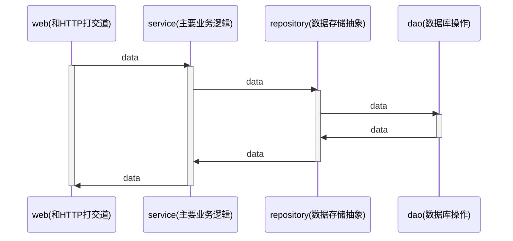

domain.User 是业务概念

dao.User 直接映射数据库中的表


**gin**

web 框架采用 https://gin-gonic.com/zh-cn/

gin middleware 库： https://github.com/gin-gonic/contrib 使用`Engine.Use`。


**middleware**

middleware 是 Go 这里用得比较多的说法，在别的语言里面可能叫做 plugin、handler、filter、 interceptor。

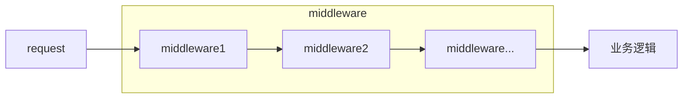

请求都要经过这些 middleware，所以适合用来解决一些所有业务都关心的东西。比如说里的跨域问题，注册的所有的路由都需要解决。也叫做 AOP(Aspect-Oriented Programming) 解决方案。


## **密码加密**

可以选择在不同的层加密

+ service 加密：加密是一个业务概念
+ repository 加密：加密是一个存储概念
+ dao 加密：加密是一个数据库概念
+ domain 加密 ：加密是一个业务概念，但应该是“用户（User）”自己才知道怎么加密

选择servcie加密。

常见的加密算法

+ md5之类的哈希算法
+ 在第一点基础之上引入盐(salt)，或者多次哈希等
+ PBKDF2、BCrypt这一类随机盐值的加密算法，同样的文本加密后的结果都不一样

选择BCrypt加密，号称最安全的加密算法。优点有：

+ 不需要自己生成盐值
+ 不需要额外存储盐值
+ 可以通过控制cost来控制加密性能
+ 同样的文本，加密后的结果不同

bcrypt加密之后无法破解，只能同时比较加密之后的值来确定两者是否相等。


## 登录功能实现(账号密码)及登录态实现(session)

登录本身分为两部分

+ 实现登录功能 (/users/login接口)
+ 登录态校验 (Cookie, Session)


浏览器会把 Cookie (是一些数据，格式是键值对) 存储到本地，这样不太安全。

Cookie 使用字段

+ 响应头字段 Set-Cookie 
+ 请求头字段 Cookie

Cookie的关键配置

+ Max-Age和Expires : 过期时间。Max-Age 单位是秒，浏览器优先采用Max-Age计算失效期。
+ Domain和Path : Cookie 可以用在什么域名和路径下。设定原则：最小化原则
  + “Domain”和“Path”指定了 Cookie 所属的域名和路径，浏览器在发送 Cookie 前会从 URI 中提取出 host 和 path 部分，对比Cookie 的属性。如果不满足条件，就不会在请求头里发送 Cookie。
+ HttpOnly : 设置为true时，浏览器上的JS代码将无法使用这个Cookie。防止“跨站脚本”（XSS）攻击窃取数据，提升Cookie安全性。
+ SameSite : 是否允许跨站发送Cookie。防范“跨站请求伪造”（XSRF）攻击，提升Cookie安全性。
+ Secure : 只能用于HTTPS协议。提升Cookie安全性。

Cookie应用：

+ Cookie 最基本的一个用途就是身份识别，保存用户的登录信息，实现会话事务。
+ Cookie 的另一个常见用途是广告跟踪。

Cookie总大小不能超过4K。

Cookie名称来源Magic Cookie，含义不透明的数据。

注意，Cookie 并不属于 HTTP 标准。


因为Cookie不安全，所以关键数据可以存储到Session中，并保存在后端。访问系统的时候带上session id，后端根据session id识别访问者身份。session id可放在：

+ Cookie
+ Header
+ 查询参数，即 ?sid=XXX

session中的数据存储在 `store` 结构中。（https://github.com/gin-contrib/sessions）


store选择：

+ 单机单实例部署，可选择memstore，基于内存方式实现。
+ 多实例部署，可选择redis。


redis实现store中需要

+ authentication：身份认证
+ encryption：数据加密

信息安全的三个核心概念：authentication，encryption，authorization（授权，即权限控制）


gin-session中间件的各种类型实现是面向接口编程的。可以自由切换。当你在设计核心系统的时候，或者你打算提供什么功能给用户的时候，一定要问问自己，将来有没有可能需要不同的实现。


session 刷新

需要在用户持续使用网站时，刷新过期时间。

刷新策略

+ 每次访问都刷新：性能差，对redis影响大
+ 快过期的时候刷新：快过期的时候用户没访问无法刷新
+ 固定间隔时间刷新：比如每分钟内第一次访问都刷新
+ 使用长短token

设置session有效期为60s，在登录校验的middleware中，登录校验之后顺手刷新。刷新规则是，如果没有设置过session的update_time 或者当前时间超过update_time 10s，则重置session有效期。


登录状态保持多久比较好？ 

登录状态保持多久比较好？也就是，一次登录之后，要隔多久才需要继续登录？ 

答案是取决于你的产品经理，也取决于你系统其它方面的安全措施。 

简单来说，就是如果你有别的验证用户身份的机制，那么你就可以让用户长时间不需要登录。

上述60s和10s都可根据实际情况修改。


## **/users/profile 和 /users/edit 接口设计**

/users/profile 接口设计

返回信息：邮箱，用户名，生日，个人简介

/users/edit 接口设计

可修改用户名、生日、个人简介

需校验生日格式，用户名唯一

返回错误：系统错误 / 用户名重复 / 生日格式错误返回 http code 400 Bad Request

实现：旧版设计是要从email定位用户，后修改为从session中拿出userID定位用户。按照web-->service-->repository-->dao层次操作数据库即可。

测试结果：截图在test文件


## 登录态实现(JWT)

除了使用 gin-session middleware 保持和校验登录态，也可以用JWT(JSON Web Token)。

JWT主要用于身份认证，即登录。

基本原理：通过加密生成一个 token，而后客户端每次访问的时候都带上这个 token。


JWT 简介 

它由三部分组成： 

+ Header：头部，JWT 的元数据，也就是描述这个token 本身的数据，一个 JSON 对象。 
+ Payload：负载，数据内容，一个 JSON 对象。 
+ Signature：签名，根据 header 和 token 生成。


如何进行接入改造？

使用 JWT 原始 API ：go get github.com/golang-jwt/jwt/v5 

在登录过程中，使用 JWT 也是两步： 

+ JWT 加密和解密数据
+ 登录校验

过程：

+ 在 Login 接口中，登录成功后生成 JWT token。 
  + 在 JWT token 中写入数据。 
  + 把 JWT token 通过 HTTP Response Header `x-jwt-token` 返回。 

+ 改造跨域中间件，允许前端访问 `x-jwt-token` 这个响应头。 

+ 接入 JWT 登录校验的 Gin middleware。 
  + 读取 JWT token。 
  + 验证 JWT token 是否合法。 

+ 下发HTTP请求时要携带 JWT token。
+ 从session中获取userID的地方需要改为从JWT中获取userID，如 /users/profile，/users/edit 接口

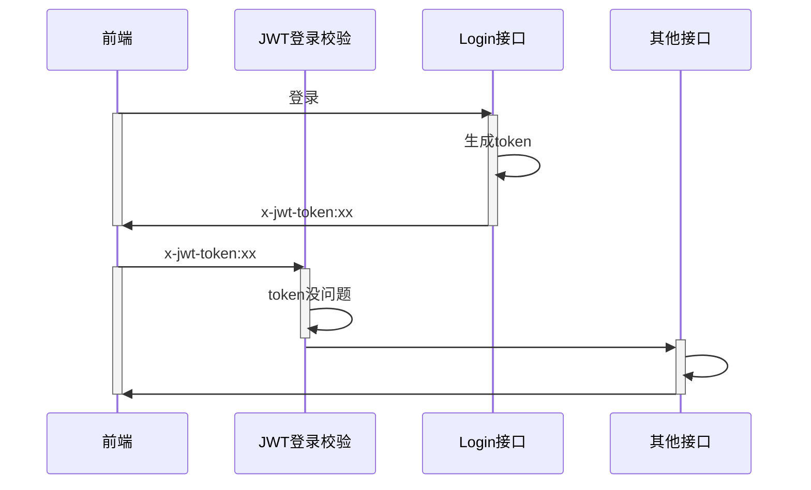


JWT 的优缺点 

和 Session 比起来，优点： 

+ 不依赖于第三方存储。 
+ 适合在分布式环境下使用。 
+ 提高性能（因为没有 Redis 访问之类的）。 

缺点： 

+ 对加密依赖非常大，比 Session 容易泄密。 
+ 最好不要在 JWT 里面放置敏感信息。


混用 JWT 和 Session 机制 

前面 JWT 限制了我们不能使用敏感数据，那么你真有类似需求的时候，就可以考虑将数据放在 “Session”里面。 

基本的思路就是：你在 JWT 里面存储你的 userID，然后用 userID 来组成 key，比如说 user.info:123 这种 key，然后用这个 key 去 Redis 里面取数据，也可以考虑使用本地缓存数据。


## 保护系统(限流)

保护系统要考虑两方面

+ 正常用户会不会搞崩你的系统？
+ 如果有人攻击你的系统，能否撑得住？

现在系统最明显的漏洞

+ 任何人都能注册
+ 任何人都能登录

限流是常见的保护系统的手段。限制每个用户每秒最多发送固定请求的数量。

问题

+ 怎么判定请求是某个用户的？未登录成功时，不知道用户是谁
+ 怎么确定限流阈值？

第一个问题：限流对象，可以用IP / MAC地址 / 设备标识符(CPU序列号) 。

第二个问题：阈值问题，理论上来说，这应该是通过压测来得到的。比如说你压测整个系统，发现最多只能撑住每秒 1000 个请求，那么阈值就是 1000。而我们是针对个人，搞不了压测。所以可以凭借经验来设置，比如说我们正常人手速，一秒钟撑死一个请求，那么就算我们考虑到共享 IP 之类的问题，给个每秒 100 也已经足够了。

实现：用redis做限流


## 保护系统(增强登录安全)

这种实现方式有个问题，不管是用 JWT 还是 Session，一旦被攻击者拿到关键的 JWT 或者 ssid，攻击者就能假冒你。 HTTPS 可以有效阻止攻击者拿到你的 JWT 或者 ssid。 但是如果你电脑中了病毒，那 HTTPS 就无能为力。

在用户登录校验过程中，得进一步判断，用这个 JWT/ssid 的人是不是原本登录的那 个人。目前做得好的都是使用二次验证，也就是发邮件、 发短信等。但是也有一些比较初步但也好用的手段，那就是用登录的辅助信息来判断。


登录的时候，记录当时登录的一些额外信息。比如说:

+ 使用的浏览器：对应到HTTP的User-Agent头部
+ 硬件信息：手机APP比较多见。

在登录校验的时候，比较一下你当次请求的这些辅助信 息和上一次的信息，不一样就认为有风险

问题:能不能用 IP? 不能，IP随时可能会切换


需要改造两个地方：

+ Login接口，在JWTtoken里面带上User-Agent信息。
+ JWT登录校验中间件，在里面比较User-Agent。


## 跨域问题处理

什么是跨域请求？

协议、域名和端口任意一个不同，都是跨域请求

从postman发送本地请求不会遇到跨域问题，但是从浏览器发送请求就可能会遇到。浏览器有这样一个机制，会自动发送preflight请求。


CORS middleware (https://github.com/gin-gonic/contrib/tree/master/cors)

+ AllowOriginFunc : 哪些来源是允许的。
+ AllowHeader : 业务请求中可以带上的头。 
+ AllowCrendentials : 是否允许带上用户认证信息(比如 cookie)。
+ ExposedHeaders : 允许显示的响应头（这样前端才能拿到）


/users/login 接口测试跨域问题解决效果

request header 中有

```
Host: localhost:8080
Origin: http://localhost:3000
Referer: http://localhost:3000/
```

response header 中有

```
Access-Control-Allow-Credentials: true
Access-Control-Allow-Origin: http://localhost:3000
Access-Control-Expose-Headers: X-Jwt-Token
Vary: Origin
```


跨域问题要点

+ 跨域问题是因为发请求的`协议+域名+端口`和接收请求的`协议+域名+端口`对不上。比如说从 localhost:3000 发到 localhost:8080 上。
+ 解决跨域问题的关键是在 preflight 请求里面告诉浏览器自己愿意接收请求。
+ Gin 提供了解决跨域问题的 middleware，可以直接使用。
+ middleware 是一种机制，可以用来解决一些所有业务都关心的问题，使用 Use 方法来注册middleware


## 压力测试与性能优化

**压测三个接口**

+ 注册 signup : 写为主的接口
+ 登录 login : 读为主的接口
+ 获取信息 Profile : 读为主的接口


**压测前准备**

压测注册接口，关键的是要发起 post 请求，然后传入不同的邮箱来模拟注册过程。

用脚本测试，按照步骤运行就可以。 首先:

+ 启用JWT来测试——因为比较好测试。如果对代码理解比较深刻，也可以使用 Session。
+ 修改/users/login对应的登录态保持时间，修改为 30 分钟，目的是确保在测试 profile 接口的时候，你拿到的 JWT token 没有过期。
+ 去除ratelimit限制


### 用wrk压测

**wrk 安装**

+ 可以用apt install wrk或者Mac上brew install wrk

+ 源码安装 : 直接源码下载git clone https://github.com/wg/wrk.git 

  而后进去这个 wrk 目录下，执行 make 命令编译。 

  编译之后你会得到一个 wrk 可执行文件，将它加入你的环境变量。


**压测注册接口**

在项目根目录下执行

```shell
wrk -t1 -d1s -c2 -s ./script/wrk/signup.lua http://localhost:8080/users/signup
# 可换不同的加密算法，测试性能
```

参数是可以调整的：

+ -t : 线程数量
+ -d : 持续时间。1s 是一秒， 1m是一分钟
+ -c : 并发数
+ -s : 后面跟着的是测试的脚本

最终能跑多少，和运行环境有关。


**压测登录接口**

在项目根目录下执行

```shell
wrk -t1 -d1s -c2 -s ./scripts/wrk/login.lua http://localhost:8080/users/login
```

因为登录接口也需要比较密码，所以同样可以考虑换加密算法。


**压测 Profile 接口**

在项目根目录下执行

```shell
# 修改脚本中 User-Agent 和 对应的 Authorization
wrk -t1 -d1s -c2 -s ./scripts/wrk/profile.lua http://localhost:8080/users/profile
```


**扩展练习**

+ 切换不同的加密算法，测试注册和登录接口。
+ 在脚本的基础上，在数据库中插入100W条用户数据，然后再测试登录接口。
+ 在数据库中插入1000W用户数据，然后再测试登录接口。


### **性能瓶颈**

在前面的代码里面，基本上性能瓶颈是出在两个地方：

+ 加密算法，耗费CPU，会令CPU成为瓶颈
+ 数据库查询

考虑引入 Redis 来优化第二点性能。优化profile接口，用户会先从 Redis 里面查询，而后在缓存未命中的情况下，就会直接从数据库中查询。

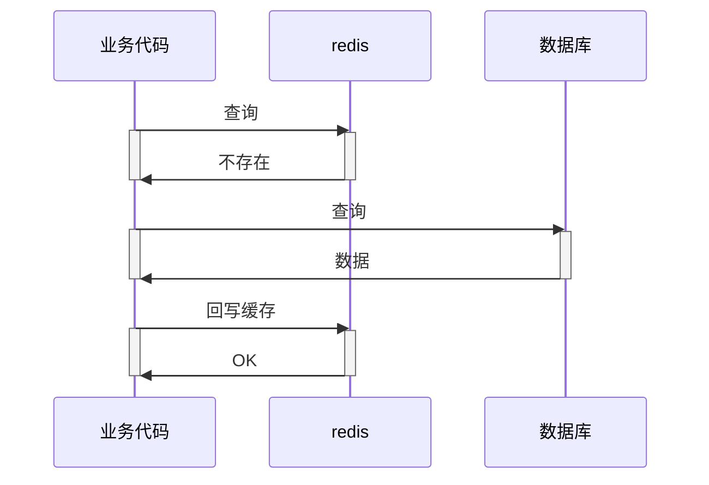

这里有一个设计要点：查询和回写缓存操作redis的时候都有可能会出错。

查询这里要权衡，要防止大量请求到打到数据库上。业务代码要考虑，数据库也可以做限流（gorm middleware）。

回写缓存这里要权衡，要不要返回错误？要不要异步写入？

要综合考虑用户体验和服务(中间件)压力。

这里是这样设计和实现的：

```go
func (ur *CachedUserRepository) FindById(ctx context.Context, id int64) (domain.User, error) {
	u, err := ur.cache.Get(ctx, id)
	if err == nil { // 缓存中找到了
		return u, nil
	}

	user, err := ur.dao.FindByID(ctx, id)
	if err != nil {
		return domain.User{}, err
	}

	u = ur.entityToDomain(user)

	go func() {
		err = ur.cache.Set(ctx, u)
		if err != nil {
			fmt.Println("ur.cache.Set error : ", err)
		}
	}()

	return u, nil
}
```


### 优化并压测

**引入缓存**

但是，servcie不能直接操作 Redis，而是要引入一个缓存抽象。

同时也不是引入一个通用的 Cache，而是为业务编写专门的 Cache。也就是 UserCache。UserCache是业务专属缓存抽象。

引入一个专门的 UserCache 是为了解决：

+ 屏蔽过期时间设置问题。也就是说，使用这个 UserCache 的人不再关心过期时间的问题。
+ 屏蔽key的结构。也就是调用者不用知道在缓存里面的这个 key 是怎么组成的。
+ 屏蔽序列化与反序列协议。当结构体写入到 Redis 的时候，要决定如何序列化和反序列化。

如何集成 UserCache？

缓存属于“如何存储数据”的范畴，所以要在 Repository 这一层集成进去，Service 对这个应该是没有感知的。同样保持依赖注入的风格，将 DAO 和 Cache 实例都注入进去。


**登录要不要利用 Redis 来优化性能?**

前面只是使用缓存优化了 /users/profile 的性能， 那么登录需不需要呢?

要不要再按照 email 映射到用户基本信息缓存一下?

答案是 : 可以，但是收益不大。

因为登录是一个非常低频的事情，正常的互联网网站都是好几天才会让你登录一次，缓存了也没用。

可以优化的点是注册后缓存信息，因为一般注册后马上就会登录。


**优化后的压力测试结果**

由于不会写lua......我改成Apifox了......测试结果在[test文件夹](https://github.com/rui-cs/webook/tree/main/test/%E6%80%A7%E8%83%BD%E6%B5%8B%E8%AF%95)


由于笔记本资源有限，users表插入了1w条数据，10个线程每个线程跑1000次profile接口，优化前平均接口耗时13毫秒，接入redis后平均接口耗时4毫秒。


### 附录

**Redis 数据结构(非底层实现)**

Redis 数据结构主要有:

+ string : 存储的key对应的值，是一个字符串。
+ list : 存储的key对应的值，就是一个链表。
+ set : 存储的key对应的值，是一个集合。
+ sortedset : 存储的key对应的值，是一个有序集合。
+ hash : 存储的key对应的值，是一个hash结构，也叫做字典结构、map结构。

还有不常用的 : bitmaps、JSON、streams、bitfields、time series。 

支持一些什么操作，可以通过 https://redis.io/commands/?group=set 来查看。


## 登录功能实现(短信验证码)

目前流行的除了账号密码登录以外，还可以是：

+ 短信验证码登录
+ 第三方平台登录
  + 微信扫码登录
  + 钉钉扫码登录
  + .......

以下实现短信验证码登录。


### 需求分析与系统设计

正常来说，如果你工作在国内的互联网公司，那么你收到的需求描述都是非常粗略的。 

所以你要掌握快速需求分析的小技巧，主要有三点： 

+ 参考竞品。应该说大部分互联网的功能都是你抄我我抄你的，所以你基本上可以参考竞品。 
+ 从不同角度分析： 
  + 功能角度：功能角度也就是明确我们做到哪些功能，有没有轻重缓急之分，一个具体的功能要做到什么程度。 
  + 非功能角度：对于中小型公司来说，按照这个顺序去思考 `安全性 > 扩展性 > 性能`。
    + 第一个保证你的系统不会被人恶意搞崩
    + 第二个是有限度应对将来的需求变更
    + 第三个是优化用户体验

+ 从正常和异常流程两个角度思考：注意区分业务异常流程和技术异常流程。 

注意，如果你的产品经理很称职，你问产品经理就可以。只有在产品经理不称职的情况下，你才需要花费比较多的功夫来分析需求。


**参考竞品** 

以我们这个验证码登录功能为例，你可以看不同公司的验证码登录的实现。 而后你就需要总结他们的功能特性： 

+ 大部分公司，在你发送手机验证码之前，都要求你先验证一下，比如说利用拼图，这一步你可以猜测是防止有人恶意触发发送短信。 
+ 大部分公司，在你发送了一个验证码之后，都不能连续发送，要隔一段时间。 
+ 大部分公司，在手机号码第一次使用的时候，直接会帮你注册一个账号。 
+ 大部分公司，手机验证码都有有效期。 
+ 大部分公司，你访问不同服务，手机验证码都是独立的，例如你在 A 功能上触发了手机验证码，在 B 功能上可以立刻触发再次发送验证码。 
+ 验证码只能使用一次，也就是验证码校验通过之后，这个验证码将无法再次使用。


**从功能和非功能的角度分析** 

在功能上，整个需求可以简单描述为： 

+ 允许用户使用手机号码接受验证码登录。在登录的时候，如果手机号码是一个全新的手机号码，那么直接注册一个新的账号。 
+ 手机验证码的有效期是 10 分钟。 
+ 用户一分钟内只能发送一次验证码。 
+ 用户登录/注册成功之后跳转到首页。 

在非功能上：保护系统，防止攻击者恶意发送短信


发送验证码流程

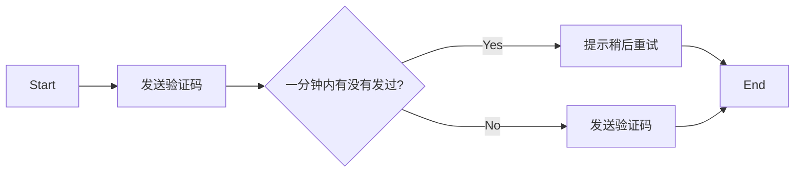

登录流程

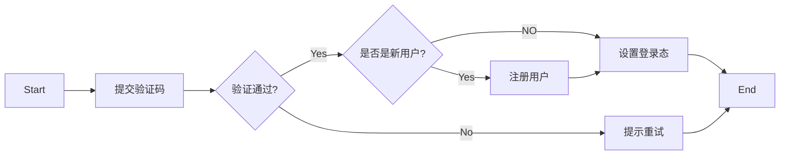


接下来你要站在一个系统设计的角度去分析，怎么实现这个功能。 

`手机验证码登录`讨论了两个事情，一个是验证码， 一个是登录。这两个是强耦合的吗？ 

也就是，别的业务有可能用手机验证码吗？ 

除了登录功能，修改密码、危险操作二次验证等业务都需要用到验证码。

所以，手机验证码应该是一个独立的功能。 

+ 如果是模块，那么它是一个独立的模块。 
+ 如果是微服务，那么它是一个独立的微服务。

进一步你会发现，手机验证码要通过短信来发送， 那么短信是不是也会被别的业务使用？ 

在把它做成一个独立的功能之后，你要进一步想： 短信这个东西，有没有可能换供应商？ 

比如说今天买了腾讯的短信，明天买了阿里的短信，后天又买了别家的短信。


综合考虑，你会发现你有两个变化点： 

+ 不同业务都要用短信功能和验证码功能 
+ 可能换供应商 

所以你就要想，我现在该怎么留出一点点扩展的空间，保证万一后面新的业务要用验证码，我这边不动，或者说少动。 

万一要是换了供应商，我这边也可以少动或者不动。


服务划分 

也可以理解为模块划分。 

所以你需要： 

+ 一个独立的短信发送服务。 
+ 在独立的短信发送服务的基础上，封装一个验证码功能。 

+ 在验证码功能的基础上，封装一个登录功能。 

这就是业务上的超前半步设计，也叫做叠床架屋。


### 短信服务

在我们之前的分析里面，起点应该是短信服务。 

因为其它服务都是在它的基础上封装的，所以要最先弄完这个。 

而进一步考虑到不同的供应商，所以这一次我们需要从接口设计开始。 

那好，我们怎么知道该如何设计接口？

以特定供应商的短信 API 开始。

在大部分业务的初期，你是知道有什么地方有扩展， 但不知道将来会怎么扩展。所以你只需要考虑当下的需求，**然后做一个简单的抽象，预留出接口就可以**。 

**你不能指望，你能够设计一个接口，用上几十年，适配所有的需求变化，这是不现实的。** 

所以这里我们就选定腾讯的短信服务，来试着抽象一个接口。


分析腾讯短信 API 并进行接口抽象

你注意看腾讯短信 API 的特点。 

首先是初始化短信客户端，里面要求传入各种鉴权参数。 

其次是发送一条短信的请求构造，里面传入的主要是短信本身相关的参数。关键的是： 

+ 目标手机号码 
+ appId：你在腾讯短信上创建的应用的 ID。 
+ 签名：要求发送的短信必须标记是谁发的。 
+ 模板：要求你提前在服务商里面配置好，得到模板 ID。 
+ 参数：发送短信的时候的具体参数。

于是你可以总结出来一个东西，对于初始化客户端来说， 主要是鉴权。但这本身算是某种特定实现在初始化的时候需要解决的内容。 

发送一次消息，需要的参数：目标手机号码、appId、 签名、模板、参数。 

其中 appId 和签名在我们小微书里面都是固定的，同样可以在初始化的时候指定，但是发送的时候就不用传递参数了。


添加 sms 包后目录结构

这个 sms 被我放在了 service 包里面，是因为我认为它是一个服务。 

业界有一些人的做法是专门准备一个第三方包，然后放进去。 

我不采用第三方包，是因为第三方不属于一种业务概念， 它是一种横向切割方式，而我做成服务，依旧是保留了竖向切割。 

这两种做法我个人认为都没什么问题，你看自己喜好。


实现

1. 定义与初始化 

   在这里，我依旧保持了依赖注入的形式，即要求外界传入一个 client，而不是自己在内部初始化一个 client。 

   （PS：理论上你可以在 NewService 里面自己初始化这个客户端。）

2. 发送实现 

   实现很简单，就是根据腾讯文档里面的描述来解析消息。 

   注意，这里我在返回 error 的时候，尽量把必要的错误信息都封装好了。


运行测试 

短信发送需要很多信息，这些需要你去开通短信服务，或者用公司的短信配置才能运行。 

+ SMS_SECRET_ID: 在环境变量中，你需要配置成自己的参数。 

+ SMS_SECRET_KEY：在环境变量中，你需要配置成自己的参数。 

appId 和 signName 你一样需要替换成自己的。 

tplId 也要换成自己的。


### 验证码服务

深入分析验证码的安全问题 

验证码一般都是 6 位数字，那么要深入考虑两个安全问题： 

1. 控制住验证码发送频率，不至于一下子发送几百万条。 

   + 同一个手机号码，一分钟以内只能发送一次。 

   + 验证码有效期十分钟。 

   + 本身整个系统也有限流，也可以保护住系统。 

2. 验证码不能被攻击者暴力破解，因为验证码只有 6 位，也就是只有十万种可能，所以不能让用户频繁输入验证码来暴力破解。 
   + 一个验证码，如果已经验证通过了，那么就不能再用。 
   + 一个验证码，如果已经三次验证失败，那么这个验证码就不再可用。在这种情况下，只会告诉用户输入的验证码不对，但是不会提示验证码过于频繁失败问题。 

注意：这个是业务复杂度，不是技术复杂度，理论上这些规则都是产品经理要告诉你的。你不需要仔细琢磨这些规则，因为你出去工作，换一个业务场景，这些全部用不上。


验证码服务接口抽象 

验证码你很容易想到，它就只有两个接口： 

+ 根据业务、手机号码，发送验证码。在这个接口里面，要控制住发送频率。 

+ 验证验证码，在这个接口你要保证验证码不会被暴力破解。 

所以这时候我们会在 service 包里面放一个CodeService，里面定义两个方法：Send 和 Verify。


#### Redis 实现

发送验证码 

验证码是一个有有效期的东西，所以最适合的存储就是 Redis， 并且设置过期时间十分钟。 

可以将 Redis 的 key 设置为 phone_code:\$biz:$phone 的形态。 

为了进一步避免恶意发送短信，我们需要控制住发短信的频率。 

因此整个思路是： 

+ 如果 Redis 中没有这个 key，那么就直接发送； 
+ 如果 Redis 中有这个 key，但是没有过期时间，说明系统异常； 
+ 如果 key 有过期时间，但是过期时间还有 9 分钟，发送太频繁， 拒绝； 

+ 否则，重新发送一个验证码。


怎么实现呢？ 

并发场景分析 

这种并发属于**业务层面上、分布式环境下的并发**，而不是语言层面上的并发，所以不能使用 channel 或者 sync.Lock 来解决。 

右图就是一个典型的多发了验证码的场景。 

在平时编程中，但凡涉及到了**检查数据-做某事**的场景，都要考虑并发安全问题。


怎么办？ 

所以，我们要考虑的就是在 Redis 层面上实现。 利用 lua 脚本将我们的检查并且做某事的逻辑 

封装成一个整体操作。 

为什么 Redis 是安全的？ 

因为 Redis 是单线程的。 

显然，Redis 是发不了验证码的，所以事实上，我们就是在 Redis 里面存验证码存好了，就认为可以发送出去了。


SendCode 实现 

调用链路如图。你应该注意到，基本上业务逻辑都在 lua 脚本。Send 方法真的要做的事情也就是调用了 sms 来真的发送验证码。


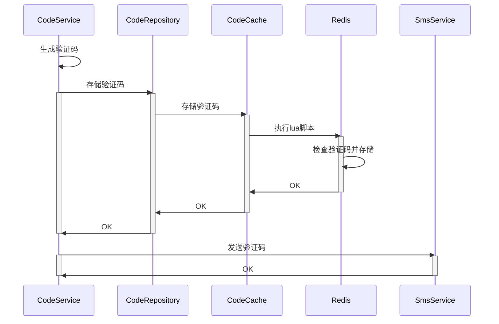


验证验证码 

验证验证码的流程是： 

+ 查询验证码，如果验证码不存在，说明还没发； 
+ 验证码存在，验证次数少于等于 3 次，比较输入的验证码和预期的验证码是否相等； 

+ 验证码存在，验证次数大于 3 次，直接返回不相等。 

所以你也可以看出来，为什么在发送验证码的时候，我们要额外存储一个 cnt 字段。 

类似地，验证验证码也要小心并发问题，所以用 lua 脚本来封装逻辑。


Verify 实现 

CodeService.Verify 极其简单。基本上所有的逻辑都在 lua 脚本里面完成了。

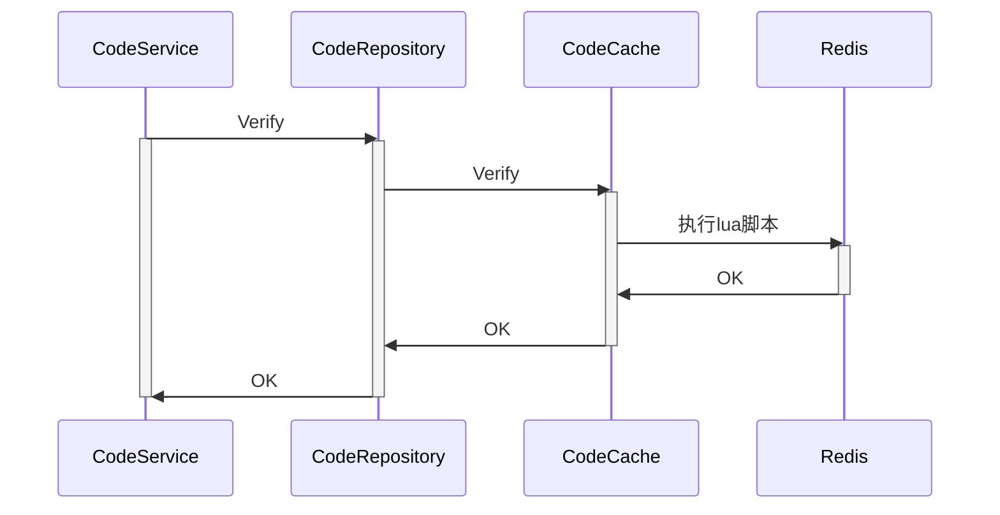


深入讨论：业务逻辑放在哪里合适？ 

按照 DDD 的理论，或者按照一般的业务开发的理论来说，前面放在 lua 脚本的逻辑应该是放在 CodeService 上的。 

也就是说 CodeService 来负责检测，CodeService 来负责校验，并且保证使用安全，系统安全。 

然而，CodeService 在这里并不好做，因为它难以解决并发问题。 

因此我们放到了 Redis 里面。缺点是，但凡你换一个缓存，比如 memcache，就得重新写一遍这个逻辑。


深入讨论：验证码发送渠道抽象 

事实上我们这里还欠缺一个更加通用的抽象，就是发送渠道的抽象。 

+ 你可能是短信发送验证码。 
+ 你也可能是邮件发送验证码。 
+ 你还可能是语音拨号告知验证码。 
+ 其它第三方平台…… 

不过，这些发送渠道你都可以在将来真正有需要的时候再抽象出来，并且提供实现。


#### 内存实现

代码：webook/internal/repository/cache/codecache_memory.go

实现 CodeCache interface 中的 Set 和 Verify 方法。

要求：保证单机并发安全。

Set 方法存储传入的验证码，Verify方法验证传入的验证码。


内存缓存在验证码业务场景下需具备以下能力：

+ 设置过期时间
+ 线程安全，单机并发安全
+ 高性能更佳


先找了下go中已有的内存缓存实现：

+ go-cache  线程安全，适用于单机，支持持久化到文件 [官网](https://patrickmn.com/projects/go-cache/) [github(star 7.4k)](https://github.com/patrickmn/go-cache) [例子](https://mp.weixin.qq.com/s/f4FAt-RgraOFXSfZmWjeoQ) [doc](https://pkg.go.dev/github.com/patrickmn/go-cache) 比较早的库，最近的更新是4年前
+ freecache [github(star 4.7k)](https://github.com/coocood/freecache) 有严格内存限制，有benchmark结果，不支持持久化到文件
+ ristretto [github(star 4.9k)](https://github.com/dgraph-io/ristretto) 性能对比：bigcache、freecache、fastcache、goburrow、groupcache
+ bigcache [github(star 6.7k)](https://github.com/allegro/bigcache)，无法设置单条过期时间，性能对比： [freecache](https://github.com/coocood/freecache) and map
+ go-zero cache [官网](https://go-zero.dev/docs/tasks/memory-cache) 单独使用较少，主要是结合go-zero生态使用
+ groupcache [github](https://github.com/golang/groupcache) [Presentations](https://go.dev/talks/2013/oscon-dl.slide#27) [例子](https://marksuper.xyz/2022/08/26/groupcache/) 分布式缓存，使用起来较复杂，功能上只增加不删改
+ fastcache [github](https://github.com/VictoriaMetrics/fastcache) 不支持过期时间

(标明的star数量截止日期为2023-09-03)

go-cache、freecache、ristretto 三个库符合需求，任选一个即可，在这里选择了ristretto库，支持单机并发安全。


选型的内存缓存只能保证对cache操作的并发安全，不能保证业务操作的并发安全。所以在业务代码中还是需要加锁。

最简单的就是整个 Set 和 Verify 方法加锁，可这样锁的粒度过大了，也没有必要选型并发安全的cache，直接一个map就可以搞定。

把锁的粒度可以缩小到cache key级别，对key的操作保证并发安全，就能保证业务操作的并发安全。


选型并发map https://github.com/orcaman/concurrent-map，用这个map存储正在操作的cache key，对Set和Verify方法不需要两个map，正常业务上Set和Verify不会同时进行。

执行Set和Verify业务流程之前要确认map中是否有本次要操作的key，若有则返回错误（操作频繁，请稍后再试），如没有则将该key加入map，使用API  `SetIfAbsent` 可以不加 `sync.Mutex` 锁。即`MemoryCodeCache.getLockByKey`。

使用完了记得释放。即`MemoryCodeCache.releaseLockByKey`。

用Apifox 并发300个请求 (login_sms和loginsms/code/send，下发内容相同)，会返回`操作频繁，请稍后再试`错误。

测试中使用的是返回固定验证码的`fixedCodeService`。


测试结果见[test文件夹](https://github.com/rui-cs/webook/tree/main/test/%E9%AA%8C%E8%AF%81%E7%A0%81%E6%9C%8D%E5%8A%A1%E5%86%85%E5%AD%98%E5%AE%9E%E7%8E%B0)。


#### 验证码加密

使用与密码加密相同的方式BCrypt。

存储时加密，验证时解密。

新增CodeCache实现 `RedisEncryptCodeCache`。没有研究lua加密，所以verify方法没有采用lua脚本。

测试结果在[test文件夹](https://github.com/rui-cs/webook/tree/main/test/%E9%AA%8C%E8%AF%81%E7%A0%81%E5%8A%A0%E5%AF%86)。


### 用户验证码登录

验证码登录接口 

整体来说，我们需要两个 HTTP 接口： 

+ 触发发送验证码的接口。 
+ 校验验证码的接口。 

我都定义到了 UserHandler 里面。也就是 UserHandler 通过聚合 CodeService 来实现验证码登录。

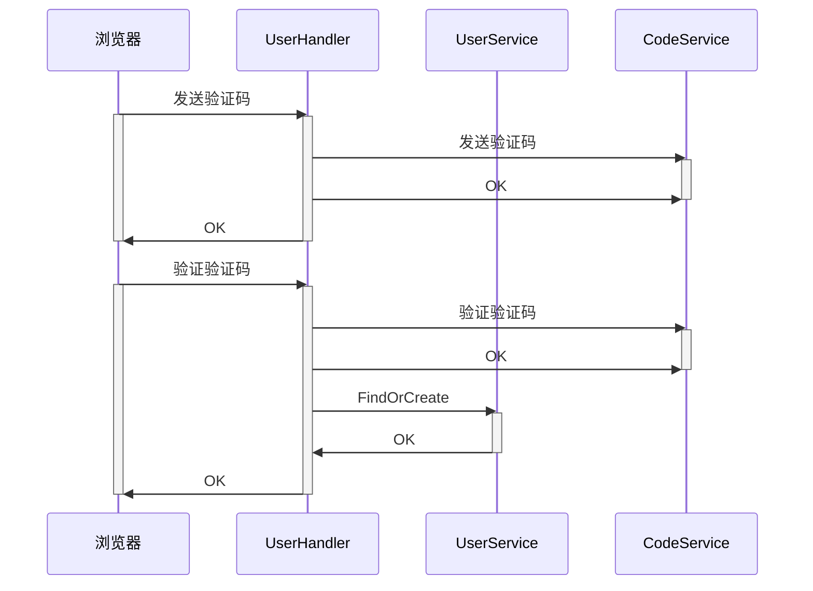


发送验证码核心逻辑 

其实就是校验，然后剩下的事情都交给 CodeService。 

最后根据 CodeService 的返回值，返回不同的错误信息。


验证码登录逻辑 

也很简单，就是调用 CodeService 和 UserService 来实现业务逻辑。


FindOrCreate 并发问题 

这个也是典型的查找-做某事的场景，所以天然就有不一致的问题。 

比如说两个人都在用同一个手机号码来注册，同时发送验证码，同时校验通过。那么就会同时注册两个用户。 

好在，我们可以在数据库中加一个手机号码的列，并且设置为唯一索引来防止这个问题。


FindOrCreate 逻辑 

右边是一种兼顾性能的写法，你后面在利用唯一索引的时候可以借鉴类似的思路。 

思路是： 

1. 先查询，如果存在，直接返回。 
2. 否则，注册一个用户，如果成功，直接返回。 
3. 否则（此时说明遇到了并发问题），查询用户，返回。 

注意，第三点本身是可以进一步优化安全性的，就是要求用户重新走验证码登录流程，这里没有做。 

毕竟……正常用户走不到第三点。


唯一索引的问题 

引入手机号码这一个列之后，就会有一个新的问题： 

+ 邮箱注册的，没有手机号。 

+ 手机号注册的，没有邮箱。 

也就是，对应的值是 NULL。 

那么在 Go 里面，怎么让 ORM 插入一个 NULL 值呢？ 答案就是用 sql.NullXXX 这一家族类。 

你可以使用指针，但是我个人不喜欢用指针，因为要判 nil 。


为什么在 UserHandler 里面聚合？ 

按照最严格的标准来说，我们其实需要一个 UserAggrService，即用户聚合服务，在这个服务里面完成发送验证码和验证码登录的逻辑。但是我们还没复杂到这个地步，就可以直接用 UserHandler 来聚合。


如何本地运行？

使用本地的 sms 来实现短信登录服务 

本地运行的话，我提供了一个本地的发消息的实现，在 sms 的子包 localsms 里面。 

你能在控制台看到打印出来的验证码。


## 依赖注入与 wire(代码改造)

### 依赖注入概念

已有的初始化代码

你仔细看我们的初始化代码，就会发现整体来说可以分成几个步骤：

+ 初始化第三方依赖，也就是 DB、Redis 等。
+ 用 DB、Redis 等来初始化 DAO、Cache。
+ 用 DAO、Cache 初始化 Repository。
+ 用 Repository 初始化 Service。
+ 用 Service 初始化 Handler。
+ 初始化 Gin，注册路由。
+ 初始化结束。

整个过程就是层层组装，也是标准的依赖注入写法。

所谓的依赖注入，是指 A 依赖于 B，也就是 A 要调用 B 上的方法，那么 A 在初始化的时候就要求传入一个构建好的 B。


两种写法对比

+ 依赖注入写法：不关心依赖是如何构造的。

+ 非依赖注入写法：必须自己初始化依赖，比如说 Repository 需要知道如何初始化 DAO 和 Cache。由此带来的缺点是：
  + 深度耦合依赖的初始化过程。
  + 往往需要定义额外的 Config 类型来传递依赖所需的配置信息。
  + 一旦依赖增加新的配置，或者更改了初始化过程，都要跟着修改。
  + 缺乏扩展性。
  + 测试不友好。
  + 难以复用公共组件，例如 DB 或 Redis 之类的客户端。


### wire入门

引入依赖注入中间件

依赖注入的缺点就是要在系统初始化的过程中（main函数），完成复杂冗长的构造链表。

所以我们可以借助一些中间件来帮助我们完成这些复杂又没有多少技术含量的事情。

在 Go 里面，我推荐使用 wire。

wire 分成两部分，一个是在项目中使用的依赖，一个是命令行工具。

wire 安装。

```shell
go install github.com/google/wire/cmd/wire@latest
```

确保 GOPATH/bin 在你的环境变量 PATH 里面，不然就是 command not found


wire 简单示例

wire 使用有两个基本步骤：

+ 往 wire 里面注册各种初始化方法。
+ 运行 wire 命令。

第一步相当于告诉 wire，我有什么东西，每个东西是怎么初始化的。

第二就是让 wire 完成组装。


wire 生成代码

可以看到， wire 是利用了代码生成技术。

它会根据你传入的各种构造方法，分析其中的依赖，然后生成一个真正的初始化方法。

注意，wire 本身并不支持单例模式，因此，假如你多次调用 InitDB，那么就会生成多个 gorm.DB。

后面我们会解决这个问题。


**IoC：控制反转**

依赖注入是控制反转的一种实现形式。

还有一种叫做依赖发现。比如说 A 调用 B，然后 A 自己去找到可用的 B，那就是依赖发现。

简单来说，如果 A 用 B 接口的时候，需要自己创建一个，比如说 UserHandler 里面自己创建一个 UserService 的实现，那么 UserHandler 就和 UserService 的实现耦合在一起了。

控制反转的意思就是，UserHandler 不会去初始化UserService。要么外面传入 UserService 给UserHandler，这种叫做依赖注入；要么是 UserHandler自己去找一个 UserService，这种叫做依赖查找。


### 使用 wire 改造代码

组装过程

整个过程可以看右图。

关键点：

+ DAO、Repository、Service 和 Handler 都已经有构造方法了。

+ 需要有一个新的方法，用于准备接入的 Gin HandlerFunc。

+ 需要有一个新的方法，初始化对应的 sms.Service。

+ 需要有一个新的方法，集成所有的 Handler、Gin HandlerFunc，完成路由注册。

而后在 main 函数里面直接启动就可以。

预期中的 main 函数：main 函数什么事情也不干，就是直接启动。


**组装 Repository 部分**

这里我们引入了一个新的 ioc 包，用于封装提供依赖的逻辑。

右图中：

+ InitRedis 会提供一个 Redis 的客户端。
+ InitDB 会提供一个 gorm.DB。


**组装 Handler 部分**

目前我们只有一个 Handler，也就是 UserHandler。

ioc.InitSmsService 是用于提供一个 SMS 服务，也就是发送短信的服务。


**InitSmsService**

wire 有一个缺陷，就是没有办法指定在不同的环境下使用不同的实现，所以这里我们只能直接写死，必要的时候再切换。


**组装 gin.Engine**

wire 的另外一个缺陷，是不能找到某个类型的所有实例。

也不能找到某个接口的所有实现，所以我们只能手写。


**GinMiddlewares**

只能写死。

而在类似的 Java 的 Spring 全家桶里面，是不需要自己写的。


缺点那么多，为啥还要用 wire？

前面提到的 **wire 的缺点**：

+ 缺乏根据环境使用不同实现的能力。
+ 缺乏根据接口查找实现的能力。
+ 缺乏根据类型查找所有实例的能力。

这也就导致我们的依赖注入的代码，始终做不到非常清爽。

一句话，wire 也就是矮个子里面挑高个。

wire 最大的好处就是很清晰，可控性非常强


**已有代码的缺点**

难以避免的修改有两个地方：

+ 每次增加一个新的 Handler，都要修改 ioc.InitWebServer。
+ 每次要启用新的 Gin 的 middleware，都要修改 GinMiddlewares。

而后肯定要修改的一个地方是：每次增加新的 DAO、Repository 等，都要修改 wire.go 里面的代码。

不过一句话：再怎么修改，也比直接手写要来得快。


使用tips：

1. go mod tidy
2. goland设置构建标记 wireinject
3. 执行wire


## 面向接口编程(代码改造)

什么是面向接口编程？

面向接口编程是指将应用程序定义为组件的集合，组件与组件之间的通信必须通过接口。

简单来说，就是如果你要用到另外一个类型，那么你肯定用的是接口。

比如说 A 调用 B 的时候，B 必须是一个接口。

结合依赖注入，就是写代码的时候 A 调用 B，B 是一个接口。而后在初始化的时候，注入一个实现了 B 接口的实例。


CodeCache 是一个结构体，所以肯定不是面向接口编程。

CodeService 对 sms.Service 的用法就是面向接口编程。

所以你可以注入不同的实现，比如说腾讯云的实现，或者基于内存的实现。


为什么要面向接口编程？

为了扩展性。

面向接口编程本身并不能提高性能或者可靠性。

但面向接口编程，能够有效让你的代码充满扩展性，正如 sms.Service，你可以随时提供一个基于内存的实现、基于腾讯的实现。

将来你要是想换供应商，你都可以随便换，只需要提供一个实现就可以。


改造已有的代码

为了方便接下来的测试，我们现在先提前把代码都改造为面向接口编程的形式。

因为缓存和 DAO 位于最底部，也就是它们没有使用别的类型，所以我们从它们开始改造。


改造 UserCache

这里实现只有一个，叫做 RedisUserCache，意思就是它是基于 Redis 来实现的。

这意味着将来你可以：

+ 提供本地缓存实现。
+ 提供 Memcache 实现。
+ 提供本地缓存 + Memcache 双重缓存的实现。
+ 甚至于还可以进一步提供各种缓存模式的实现。


改造 UserRepository

这里实现只有一个，叫做CachedUserRepository，意思就是使用了缓存的实现。

将来你可以考虑：

+ 不使用缓存，或者使用不同的缓存。
+ 甚至不用数据库，使用 NoSQL 啥的。


改造 UserService

UserService 从理论上来说不太可能有别的实现，但是我们依旧有一个接口。

将来可能是：

+ 不同版本有不同实现。
+ 是否 VIP 有不同实现。

不过当下引入接口就是为了测试。

因为实现没有特别之处，所以就直接叫做userService。不是好的命名，但是能用。


改造 UserHandler

UserHandler 本身并没有引入接口，是因为没有人用它，而且现在也没有看到需要引入不同实现地方，所以暂时保留。

PS：用它，是指调用它的方法。注册路由虽然也算用了，但是可以推迟到将来再来抽取接口。


结合 wire 使用

在使用 wire 的时候，注意你的初始化方法NewXXX 最好返回接口。

不过 Go 的推荐做法是返回具体类型，这和wire 是冲突的。

这样 wire 可以直接使用类型匹配。


## 第三方服务调用治理

第三方服务调用治理

要知道，一切不在你控制范围内的东西，都是不定时炸弹，冷不丁就炸了。

所以，针对一切跟第三方打交道的地方，都要做好容错。

推而广之，只要接口不是你写的，你调用的时候都要考虑做好治理。

记住血泪教训：不要相信公司外的人，不要相信别的部门的人，不要相信同组的人，最后不要相信昨天的自己。


整体思路

核心思路就是两点：

+ 尽量不要搞崩第三方。
+ 万一第三方崩了，你的系统还要能够稳定运行。

具体到短信服务这里：

+ 短信服务商都有保护自己系统的机制，你要小心不要触发了。比如说短信服务商的限流机制。

+ 短信服务商可能崩溃，你和短信服务商之间的网络通信可能崩溃，所以你要想好容错机制


### 客户端限流

先来看第一个点。

在腾讯的短信 API 里面，它系统本身的限流阈值是3000/s 。

对于你的系统来说，如果你一秒内发送了 3000 个请求，都能处理。

但是如果你超过了 3000 次，就会被拒绝。

因此，与其等着腾讯那边返回限流响应，还不如你直接本地就限制住。


第一种做法：整体限流

在 Web 里面我们接触过了限流，这里我们沿用已有的限流方案，利用 Redis 限制系统不会超过 3000/s。

为此，我们可以尝试将原本的限流逻辑抽取出来，做成一个抽象的限流器的概念。


限流器抽象

在 Web 里面我们接触过了限流，这里我们沿用已有的限流方案，利用 Redis 限制系统不会超过3000/s。

为此，我们可以尝试将原本的限流逻辑抽取出来，做成一个抽象的限流器的概念。

PS: 虽然 Redis 定义了一个 Limiter 接口，但是我们不用。

和原本 ratelimit 的 Gin 插件比起来，这个限流器去掉了前缀（prefix）字段，因为它作为一个非常通用的限流器实现，不需要提供这种前缀功能。


在已有的代码里面集成限流器

通过之前在 Gin 插件里面的代码，你基本上也能想到，要改造的的地方很简单：

+ 保持依赖注入风格，要求初始化腾讯短信服务实现的时候，传入一个限流器。

+ 在真的调用腾讯短信 API 之前，检查一下是否触发限流了。


进一步改进

右边的这个实现，你觉得有没有问题？

+ 从功能性上来说，没有问题；
+ 从扩展性上来说，都是问题；
+ 从无侵入式上来说，更加是问题。

仔细分析你会想到：

+ 如果将来我有别的短信服务商，别的短信服务商要不要限流？显然要。

+ 要是再有类似的功能，岂不是还得继续修改Send 方法？改来改去，这个 Send 方法不就成了屎山吗

无数的屎山就是这么一点点改出来的。如果你准备让自己职业生涯过得轻松，就一定要克制自己，三思而后行。


利用装饰器模式来改进

正常来说，你要在一个已有实现的基础上叠加一个新特性，那么就非常适合装饰器模式。

装饰器模式（大明版定义）：不改变原有实现而增加新特性的一种设计模式。

装饰器可以层层叠加，我称之为叠床架屋。


如何理解装饰器模式


用装饰器模式实现限流的短信服务

下面和右边实现的代码，可以注意到：

+ 依旧保持面向接口和依赖注入的风格。
+ svc 也就是被装饰者。
+ 最终业务逻辑是转交给了 svc 执行的。
+ 该实现就只处理一件事：判断要不要限流。


单元测试装饰器

这边我们依旧保持了面向对象编程，也就是说，不管是 Limiter 还是 Service，用的都是接口。

所以都可以用 mock 的实现来测试效果。

记得用 mockgen 命令生成各种 mock 实现。

右边是单元测试的定义


装饰器的另外一种实现方式

也可以考虑使用组合来实现装饰器。

RatelimitSMSServiceV1 就是组合的做法。

两种方法对比：

+ 使用组合：

  + 用户可以直接访问 Service，绕开你装饰器本身。

  + 可以只实现 Service 的部分方法。

+ 不使用组合：
  + 可以有效阻止用户绕开装饰器。
  + 必须实现 Service 的全部方法。


开闭原则、非侵入式、装饰器

这是三个经常一起出现的概念。

+ 开闭原则：对修改闭合，对扩展开放。
+ 非侵入式：不修改已有代码。

记住一句话：侵入式修改是万恶之源。它会降低代码可读性，降低可测试性，强耦合，降低可扩展性。

侵入式 = 垃圾代码，这个等式基本成立。

除非逼不得已，不然绝对不要搞侵入式修改！！！


### 自动切换不同服务商


服务商出了问题

前面的限流是为了不触发服务商的自我保护机制。

但是，万一服务商真的出了问题呢？

即便服务商的可用性做到了四个九，也还是有小概率崩溃，怎么办？

可以考虑在服务商出了问题的时候，切换到新的服务商。


怎么知道服务商出了问题？

问题在于，你怎么知道服务商出现问题了？

你无法准确知道，但是可以大概猜测一下。

+ 频繁收到超时响应。
+ 收到 EOF 响应或者 UnexpectedEOF 响应。
+ 响应时间很长。
+  ……

如果你和服务商的关系很紧密，那么可以询问服务商有没有什么特定的错误码可以判定它已经崩溃。


第一种策略：failover

有一种很简单的策略 failover，就是如果出现错误了，就直接换一个服务商，进行重试。

一样可以使用装饰器模式来实现


failover 第一种实现

直接搞一个轮询。svcs 就是全部可用的服务商实现。

全部轮询完了都没成功，那就说明所有的服务商挂了。

当然，出现这种情况的更大可能性是你网络崩了。

缺点：

+ 每次都从头开始轮询，绝大多数请求会在svcs[0] 就成功，负载不均衡。

+ 如果 svcs 有几十个，轮询都很慢。


failover 第一种实现测试

一样使用 sms.Service 的 mock 来测试，还是很容易的。


failover 第一种测试用例

一样使用 sms.Service 的 mock 来测试，还是很容易的。


failover 第二种实现

有两个改进点：

+ 起始 svc 是动态计算的。
+ 区别了错误：context.DeadlineExceeded 和context.Canceled 都是跟用户体验密切相关的，所以我们直接返回。

这边你不需要考虑 idx 溢出的问题，uint64 让你发短信发到天荒地老都用不完。


failover 第二种实现中 idx 的效果

我们并没有使用严格的轮询策略，而只是起始svc 是轮询的，如右图。

下图是严格轮询。严格轮询要控制并发，代码更加复杂。


failover 第二种实现中使用的原子操作

原子操作是轻量级并发工具。

面试中一种并发优化的思路，就是使用原子操作。

原子操作在 atomic 包中，注意原子操作操作的都是指针。

记住一个原则：任何变量的任何操作，在没有并发控制的情况下，都不是并发安全的


第二种策略：动态判定服务商状态

前面的轮询 failover 是非常简单的策略。

另外一个策略就是真的计算服务商是否还运作正常。常用的判断标准有：

+ 错误率：例如连续 N 个超时响应，错误率超过 10%。
+ 响应时间增长率：例如响应时间从 100ms 突然变成 1s。

你可以根据自己调用的服务商的特点来确定使用哪个。


基于超时响应的判定

这种判定方法有一个基本的假设：如果服务商有问题，那么你必然会拿到超时响应，而且不是只有一个两个，是大多数都拿到超时响应。

这里我用一个比较简单的算法：只要连续超过 N 个请求超时了，就直接切换。

如果有多个服务商，那么就是在这些服务商之间逐个切换过去。


具体实现

右图的实现不是非常严格的“连续 N 个超时就切换” ，而是近似。

这是因为在使用原子操作的时候，会有一些并发场景破坏“连续 N 个超时就切换” 。

但是不影响实际效果，只是可能导致更加频繁切换。


单元测试

这里面涉及到并发问题，所以很难测试。也就是，你没办法通过 mock 之类的东西来判断你的代码是不是并发安全的。你只能说，在没有并发问题的情况下，这个代码的运行结果是符合你的预期的。

注意：并发代码的测试，大部分时候只能有限度的测试。更大程度上是依赖于代码 review 来保证的。


### 提高安全性

提高安全性

如果你在一个大公司，那么类似于短信这种资源，是需要考虑安全和成本控制的。比如说利用审批流程来申请一个 tpl（模板），里面要求业务方对自己的用量进行评估。

而后要考虑：

+ 只有特定的组才能使用这个 tpl。
+ 这个 tpl 的容量不能超过一个数。比如说总共就是一个月十万条，多了就要额外申请，以达成成本控制的目标


权限控制

这里考虑一下，怎么做到某个 tpl 只能被申请的业务方使用？

使用 token。

而且是内部调用，可以使用静态 token。

即业务方申请一个 tpl，而后你颁发一个 token给它，要求它调用你的接口的时候，带上这个token。


使用 JWT token

有两种设计方案：

+ 第一种在 Send 方法里面加上一个 token 参数。
+ 第二种是直接用 token 参数替换掉 tpl 参数。所需的各种数据，从 token 中解密出来。

这里我们用第二种。当业务方申请的时候，给业务方一个 JWT token，里面包含了一些跟业务方有关的信息。

注意：认 token 不认人！


使用 JWT token 实现

内部调用鉴权是不需要做得很复杂的，一般搞个token 就可以了。

也可以考虑提供一个动态生成 token 的服务，而后颁发给业务方 appId 和 appSecret。每次用appId 和 appSecret 来交换临时 token。


### 同步转异步

设计一个新的容错机制，同步转异步的容错机制。当满足以下两个条件中的任何一个时，将请求转储到数据库，后续再另外启动一个 goroutine 异步发送出去。

+ 触发了限流。
+ 判定服务商已经崩溃。

要求：

+ 如何判定服务商已经崩溃，不允许使用课程上的判断机制，你需要设计一个新的判断机制，并且解释这种判定机制的决策理由。

+ 控制异步重试次数，转储到数据库之后，可以重试 N 次，重试间隔你可以自由决策。
+ 不允许写死任何参数，即用户必须可以控制参数。
+ 保持面向接口和依赖注入风格。
+ 写明这种容错机制适合什么场景，并且有什么优缺点。
+ 针对提出的缺点，写出后续的改进方案。
+ 提供单元测试。

自己设计方案，包括优缺点分析、改进方向必须独立完成。


## 单元测试

### 单元测试介绍

已有代码测试困难

怎么办？

正常的业务开发之后的测试流程，都是先单元测试，后集成测试。

+ 单元测试：针对每一个方法进行的测试，单独验证每一个方法的正确性。

+ 集成测试：多个组件合并在一起的测试，验证各个方法、组件之间配合无误。

所以我们要先搞单元测试，单元测试初步验证之后，再集成测试。

单元测试验证了各个方法的基本逻辑之后，集成测试就比较少问题了。


单元测试

单元测试讲究的是快速测试、快速修复。

+ 测试该环节中的业务问题，比如说在写测试的时候，发现业务流程设计得不合理。

+ 测试该环节中的技术问题，比如说 nil 之类的问题。

单元测试，从理论上来说，你不能依赖任何第三方组件。

也就是说，你不能使用 MySQL 或者 Redis。

如右图，要快速启动测试，快速发现 BUG，快速修复，快速重测


在 Go 中编写单元测试

在 Go 中编写单元测试，很简单：

+ 文件名以 _test.go 结尾。
+ 测试方法以 Test 为开头。
+ 测试方法只接收一个参数： t *testing.T。

可以在 IDE 中直接运行。

注意，你同样可以用这个来写集成测试、冒烟测试、回归测试，都可以。


IDE 直接运行单元测试

如果你的测试方法签名没错的话，就能看到这个绿色图标，点击就能看到很多选项。

最主要的是：

+ Run：运行模式，直接运行整个测试。
+ Debug：Debug 模式，你可以打断点。
+ Run xxx with Coverage：运行并且输出测试覆盖率。

+ 其它 Profile 都是性能分析，很少用。

除非你要看测试覆盖率，不然都用 Debug


IDE 直接运行包下面的全部测试

在测试文件里面，点击包名旁边的绿色按钮，就可以运行整个包下面的全部测试，包括别的测试文件中的测试。


IDE 运行结果

出现绿色小勾就代表测试通过了。

正常你不修改 IDE 配置，在左边这一栏，只会显示没有通过测试的用例。


命令行运行单元测试

一般你在考虑集成 CI 的时候，就会使用命令行来执行单元测试。

使用 go test 命令：

+ go test your_test.go: 这是跑单一一个文件的测试，但你需要把 your_test.go 里面用到的文件都选进来。右图就是忘了把其它文件都包进来。一般不用这个形式。

+ go test . :运行这个包的测试，里面所有的测试都会执行。

+ go test ./... : 运行这个包的测试，包括子目录的。


Table Driven 模式

Go 里面，惯常的组织测试的方式，都是用 Table Driven。

Table Driven 的形式如右图。主要分成三个部分：

+ 测试用例的定义：即每一个测试用例需要有什么。
+ 具体的测试用例：你设计的每一个测试用例都在这里。

+ 执行测试用例：这里面还包括了对测试结果进行断言。

注意，你要优先使用 Table Driven，但是不用强求。

你把测试用例定义看做是列名，每一个测试用例就是一行数据，就能理解 Table Driven 这个含义了。


运行 Table Driven 下的单个测试

当你使用前面那种 Table Driven 的模式时，可以单个运行测试用例


测试用例定义

我总结的测试用例定义，最完整的情况下应该包含：

+ 名字：简明扼要说清楚你测试的场景，建议用中文。

+ 预期输入：也就是作为你方法的输入。如果测试的是定义在类型上的方法，那么也可以包含类型实例。

+ 预期输出：你的方法执行完毕之后，预期返回的数据。如果方法是定义在类型上的方法，那么也可以包含执行之后的实例的状态。

+ mock：每一个测试需要使用到的 mock 状态。单元测试里面常见，集成测试一般没有。

+ 数据准备：每一个测试用例需要的数据。集成测试里常见。

+ 数据清理：每一个测试用例在执行完毕之后，需要执行一些数据清理动作。集成测试里常见。

最完整的意思是：如果你要测试的方法很简单，那么你用不上全部字段。


运行测试用例

测试里面的 testCases 是一个匿名结构体的切片，所以运行的时候就是直接遍历。

那么针对每一个测试用例：

+ 首先调用 mock 部分，或者执行 before。
+ 执行测试的方法。
+ 比较预期结果。
+ 调用 after 方法。

注意运行的时候，先调用了 t.Run，并且传入了测试用例的名字。


设计测试用例

测试用例定义和运行测试用例都是很模板化的东西。

测试用例就是要根据具体的方法来设计。

+ 如果是单元测试：看代码，最起码做到分支覆盖。
+ 如果是集成测试：至少测完业务层面的主要正常流程和主要异常流程。

单元测试覆盖率做到 80% 以上，在这个要求之下，只有极少数的异常分支没有测试。

其它测试就不是我们研发要考虑的了，让测试团队去搞。


不是所有的场景都很好测试

即便你的代码写得非常好，但是有一些场景基本上不可能测试到。

右图中的 error 分支，就是属于很难测试的。

因为 bcrypt 包你控制不住，Generate 这个方法只有在超时的时候才会返回 error。

那么你不测试也是可以的，代码 review 可以确保这边正确处理了 error。

记住：没有测试到的代码，一定要认真 review


### 测试 Handler

**HTTP 接口测试**

按照我们的代码的实现思路，从 Handler 开始写测试代码。

Handler 测试代码的难点在于：

+ 构造 HTTP 请求：Handler 的方法都是处理 HTTP请求的，也就是我们得想办法构造 HTTP 请求。

+ 验证HTTP 响应：Handler 的方法返回的响应都是HTTP 响应，这就导致我们也需要考虑验证 HTTP响应


**构造 HTTP 请求**

因为这里还是单元测试，所以没有必要真的经过网络发起 HTTP 请求，而是可以考虑使用编程手段，构造HTTP 请求。

如右图，我们可以通过控制 HTTP 方法、URL 和传入的Body，构造出任何一种情况。


**获得 HTTP 响应**

既然我们没有经过网络来发送 HTTP 请求，那么怎么拿到HTTP 响应呢？

答案是：传入一个可以存住数据的 http.ResponseWriter。

这种情况下，测试的时候，返回的响应实际上是写入到了这个特殊的 ResponseWriter 里面


**利用 httptest 来记录响应**

httptest 包里面已经提供了这么一个东西，可以帮助我们记录响应。

也就是 httptest.Recorder。

从右图中你也能看出来，通过这个 Recorder，我们能够知道，响应究竟写了些什么。

因此就可以进一步，在测试中比较 Body 和 Code 是否符合我们的预期。


**怎么解决 UserHandler 的初始化问题？**

现在还剩下一个问题，就是 UserHandler 在初始化的时候，是需要传入 UserService 和 CodeService 的，怎么办？

如果单元测试也要构造这两个 Service，岂不是得一路构造到 DAO，然后就需要在数据库中准备数据？

不，解决思路是，使用 mock 工具来生成测试用的模拟UserService 和 CodeService。


**mock 工具入门**

原本 Go 团队提供了一个 mock 工具 https://github.com/golang/mock，但在今年放弃维护了，改用 https://github.com/uber-go/mock。

它分成两个部分：

+ mockgen：命令行工具。
+ 测试中使用的控制 mock 对象的包。

安装命令行工具：

```shell
go install go.uber.org/mock/mockgen@latest
```

为 UserService 和 CodeService 生成 mock 实现

前面安装的 mockgen 可以为接口生成 mock 实现。

mockgen 一般要指定三个参数：

+ source：也就是你接口所在的文件。
+ destination：也就是你生成代码的目标路径。
+ package：也就是生成代码的文件的 package。

如右图，是命令

```shell
mockgen -source= ./webook/internal/service/user.go -package=svcmocks -destination= ./webook/internal/service/mocks/user.mock.go
```

记住在项目根目录下运行。


**简易 make 命令**

我提供了一个 Makefile 来封装这些命令，你可以直接运行 make mock。

但是 Windows 系统（非 WSL），就直接复制到命令行运行，记住使用 Windows 的文件分隔符。


**使用 mock**

使用起来很简单，都是一样的套路：

+ 初始化控制器，这里是 ctrl。
+ 创建模拟的对象，这里是 usersvc。
+ 设计模拟调用
  + 先调用 EXPECT，不要忘了。
  + 调用同名方法，传入模拟的条件。
  + 指定返回值。

注意事项：你设计了几个模拟调用，在使用的时候就都要用上，而且顺序也要对上！！！！不能多！！！不能少！！！不能乱！！！

记住一条原则：后续但凡出现和 mock 有关的错误，你就检查多了没，少了没，漏了没，条件对上了没


测试看起来的样子

综合起来，一个测试的执行过程就是：

+ 准备一个 gin.Engine，并且注册路由。
+ 准备请求。
+ 准备接收响应的 Recorder。
+ 直接发起调用，也就是假装收到了 HTTP 请求。
+ 比较 Recorder 里面记录的响应。

注意，当你调用 ServeHTTP 的时候，效果等价于server 真的从网络里面收到了一个请求


**测试用例定义**

从前面一个测试的执行过程中，我们尝试设计一下测试用例的定义，也就是 Table Driven 中的匿名结构体的字段。

我们从 SignUp 开始，因为它比较复杂。根据之前我给你看过的测试用例定义模板，你很快就能定义出类似右图的东西。

注意：mock 字段基本上是原本的代码依赖了什么，你就需要 mock 什么。所以这里我们返回了 UserService和 CodeService 两个。


**执行测试用例代码**

测试用例定义出来之后，怎么执行这些用例，就已经呼之欲出了。

这里分成几个部分：

+ 初始化 mock 控制器，每个测试用例都有独立的mock 控制器。

+ 使用控制器 ctrl 调用 tc.mock，拿到 mock 的UserService 和 CodeService。

+ 使用 mock 的服务初始化 UserHandler，并且注册路由。

+ 构造 HTTP 请求和响应 Recorder。
+ 发起调用 ServeHTTP。


#### 测试注册成功

设计测试用例：注册成功

先来看第一个注册成功的例子。

设计测试用例，要根据已有的代码来设计。后面讲到 TDD（测试驱动开发），就是反过来，先设计测试用例，再有代码实现。

要想注册成功，意味着你需要保证：

+ 输入合法，不会走到前面的校验错误分支。
+ UserService.Signup 返回 nil。

而注册成功就意味着：

+ 状态响应码是 200。
+ 拿到的结果是“注册成功”这个字符串


设计测试用例：注册成功 mock

根据用例的基本定义和前面的分析，我们首先可以确定，mock 里面应该返回一个模拟调用 Signup 返回 nil 的UserService


设计测试用例：注册成功的 HTTP 请求和响应

可以看到，在 reqBuilder 我们手动构造了一个 HTTP请求。

并且设置了预期中的响应。即在这个测试用例中，我们预期能够拿到 200 的响应，并收到一条“hello, 注册成功的“的响应。


运行测试用例

在设计了第一个测试用例之后，你可以立刻运行查看效果


测试数据校验逻辑

当正常流程测试完毕之后，就可以测试异常流程了。

一般来说，写出正常流程的测试用例之后，复制粘贴改一下，就是异常流程了。

注册接口的数据校验包含以下分支：

+ Bind 方法出错，你会得到 400 的响应码。
+ email 格式不对：其中 MatchString 我们没有办法让它返回 error，所以只能测试格式不对。

+ 两次输入的密码不相等。
+ 密码格式不对。

可以看到，这里再次出现了某个分支测不了的问题，这是因为 emailRegexExp 并没有实现接口，所以没法 mock。


测试 Bind 方法出错的用例

要测试 Bind 方法出错，只需要输入一个错误的JSON 串就可以。

两个注意点：

+ mock 里面，因为 Bind 方法出错，所以不会调用 UserService 上的方法，所以这里直接返回nil 都可以。

+ 我们断言 HTTP 响应码是 400，而响应的 Body是一个空字符串。


其它校验的用例

通过控制 reqBuilder 里面构建的请求，可以测试输入校验的其余情况。


Signup 失败用例

在 Signup 里面，除了输入校验以外，还有两个异常分支：

+ 邮箱冲突。
+ 系统错误。

因为我们使用了 mock 的 UserService，所以很容易模拟这两种情况。


**步骤总结**

+ 安装 mockgen 工具。
+ 为 Handler 依赖的 Service 接口生成 mock 实现。在这里是为 UserService 和 CodeService 生成mock 实现。

+ 测试用例匿名结构体定义。
+ 执行测试用例的整体代码。
+ 设计具体测试用例并运行：
  + 最开始考虑正常流程。
  + 在正常流程的基础上考虑异常流程


#### 测试验证码登录

```shell
# 运行单元测试并计算覆盖率
go test -run TestUserHandler_LoginSMS -coverprofile=loginsms.out

# 查看测试覆盖情况
go tool cover -html=loginsms.out 
```

测试结果和覆盖情况在[test文件夹](https://github.com/rui-cs/webook/tree/main/test/loginsms%E6%B5%8B%E8%AF%95)。

只有设置jwt token部分测试无法测试。


### 测试 Service

经过前面 Handler 的测试之后，再让你测试 Service 就很简单了。

因为 Service 本身没有复杂的 HTTP 请求输入和输出的困扰。

你只需要为 Service 依赖的 Repository 生成依赖的 mock实现就可以了。

同样，直接执行 make mock 命令。Windows 环境下的同学记得替换文件分隔符。


**测试 Login 方法**

Login 方法的逻辑很简单，有三个分支：

+ 用户找不到
+ 密码不正确
+ 登录成功

而且它只会用到 UserRepository 中的 FindByEmail。


测试用例定义

右边是测试用例的定义，也可以看出来它基本符合之前介绍的模板。

+ 用例名字。
+ mock：创建 mock 的 repository.UserRepository实例。

+ 测试输入。
+ 预期输出


登录成功用例

用户未找到错误用例

密码错误测试用例


### 测试 Repository

测试 Repository

测试 Repository 也很简单，也是为 Cache 和DAO 生成 mock 实现，然后设计测试用例。

这里以 UserRepository.FindById 为例。


测试用例定义

测试用例定义也基本符合我们前面讲的模板。

+ mock：返回 mock 的 UserDAO 和 UserCache实现。

+ 输入。
+ 输出。


查找成功，缓存未命中测试用例

在这个案例中，需要 mock 的很多。业务逻辑中发起了三个调用：

+ cache.Get 和 Set 方法。
+ dao.FindById 方法。

所以在测试用例的 mock 里面，就要同时 mock 这三次调用。


1. 查找成功，缓存未命中测试用例

2. 查找成功，缓存命中测试用例

   只需要简单修改缓存未命中用例，在 mock 中直接在 Get 调用中返回 User 就可以。

   注意，缓存这边我们继续使用了 domain.User。

3. 未找到用户

   核心就是一路返回各种 error


时间相关的处理

在这个测试中，你可以看到对时间做了一些特殊处理。

核心是：

+ 数据库存储的是毫秒数，也就是纳秒部分被丢弃了。

+ 所以在 Repository 拿到时间之后，也是没有纳秒部分。


### 测试 Cache

为 Redis 的 Cmdable 生成 mock 实现

在最开始写代码的时候，我就提前用了面向接口编程，所以现在为缓存添加单元测试就非常简单了。

只需要为 Redis.Cmdable 生成 mock 实现就可以。

这个生成的命令要稍微修改一下：

```shell
mockgen -package=redismocks -destination= ./webook/internal/repository/cache/redismocks/cmd.mock.go github.com/redis/go-redis/v9 Cmdable
```


测试用例定义

缓存的测试用例定义也差不多，这里我们以CodeCache 里面的 Set 方法为例。

+ mock：返回一个 mock 的 redis.Cmdable实现。

+ 输入：包含 ctx、biz、phone、code。
+ 预期输出：只有一个 wantErr。


### 测试 DAO

测试 DAO

和其它层次的测试不一样，DAO 的测试要使用一个新的工具 —— sqlmock 来测试。

因为 GORM 本身并没有提供一个接口给我们操作，导致我们没办法生成 mock 代码。

为什么不用基于文件/内存的数据库来执行单元测试呢？比如说用 sqlite?

因为，只要真的使用数据库，你就要操心准备数据的事情了，效率太低。


sqlmock 入门

sqlmock 虽然名字也带了 mock，但实际上并不像 mock 一样需要搞代码生成，而是可以直接使用。

```
go get github.com/DATA-DOG/go-sqlmock
```

基本用法：

+ 用 sqlmock 来创建一个 db。
+ 设置模拟调用。
+ 使用 db 来测试代码：在使用 GORM 的时候，就是让 GORM 使用这个 db


定义测试用例

我们以 UserDAO 的 Insert 方法为例。

+ mock: 返回一个已经设置了模拟调用的 sql.DB。
+ 输入：ctx 和 user。
+ 输出：wantErr。


运行测试的代码

这里运行测试的代码也有点与众不同，在初始化GORM 的时候需要额外设置三个参数。

+ SkipInitializeWithVersion：如果为 false，那么 GORM 在初始化的时候，会先调用 show version。

+ DisableAutomiticPing：为 true 不允许 Ping数据库。

+ SkipDefaultTransaction：为 false 的时候，即便是一个单一增删改语句， GORM 也会开启事务。


这三个选项禁用之后，就可以确保 GORM 不会在初始化的过程中发起额外的调用。


插入成功用例

在 Go 语言里面，对于增删改来说，会有两个结果：

+ lastInsertId：INSERT 语句会有这个部分。
+ rowsAffected：受到影响的行数，比如说插入了多少行、更新了多少行、删除了多少行这种。

所以我们用 sqlmock 来构造了一个结果，里面lastInsertId 为 1，rowsAffected 也是 1


## 集成测试

集成测试

单元测试只能确保任何一个组件单独看是没有任何问题的。但是组合在一起是否有问题，就需要集成测试了。

在日常开发中，这一步主要是由测试来进行的。但你也可以考虑先提前用集成测试验证一下自己维护的所有模块。

举例来说，如果整个业务需要 A、B、C 三个模块通力合作。而你作为研发维护了 A 和 B 两个，那么你就可以先测试 A 和 B 集成的效果。


真·集成测试

现在我们准备测试整个链路。

即测试从收到请求，到返回响应的整个过程。

这种整个链路的测试和单元测试比起来：

+ 单元测试用例设计是以实现逻辑为依据的（即便用 TDD 也是这样）。

+ 集成测试用例设计是以业务流程为依据的。

  + 有一些系统错误是由程序员编码造成的，实际用户根本不可能触发，这一类是很难测试的，或者说几乎不可能在集成测试里面测到。

  + 有一些异常流程，是需要考虑并发的，这一类集成测试也很难测试到，依赖于人手工测试。


### 集成测试：以发送验证码为例

现在我们看第一个发送验证码的集成测试。

这个测试的困难就在于：我们希望测试的验证码是真的发到了手机上，然而这是一个不可能的事情，

因为我们没有办法通过手机来验证究竟有没有收到验证码。

而且，类似于发送短信这种功能，你不好发给谁，也不能浪费公司买的短信资源，所以都是用内存实现来自动化集成测试 + 测试人员手动发送验证码双层验证。


定义测试用例

整个测试用例分成了几个部分：

+ name： 测试名字。
+ before：准备数据。
+ after：验证并且删除数据。
+ phone：前端只需要传入一个手机号码，所以这里我就直接定义了。标准做法是这里定义为http.Request。

+ 预期响应
  + wantCode：HTTP 状态码。
  + wantResult：预期数据，因为直接比较JSON 很麻烦，所以直接比较 web.Result


运行测试用例

整个代码分成几部分：

+ 执行 before：也就是准备数据。
+ 构建 req。
+ 准备 recorder。
+ 调用 ServeHTTP。
+ 比较结果：
  + 比较响应码。
  + 将响应数据反序列化为 JSON 之后再比较。


总结

集成测试和单元测试比起来，有一些不同点：

+ 集成测试需要手动准备数据。
+ 集成测试在测试之后，要验证数据是否符合预期。注意：
  + 你直接使用的第三方依赖，你需要验证，比如说 Redis、MySQL 之类的。
  + 你调用别人的接口，就不需要验证，你只需要验证它返回的响应就可以。

注意：永远不要让测试用例之间互相依赖。比如说在这里发送太频繁的用例完全可以依赖于存储成功用例，但是不要这么做！！！！相互之间有依赖关系的测试用例非常难维护！！！后续一重构就各种崩溃，你都改不过来！！！


### 单独测试和第三方的复杂交互

提前测试 Redis lua 脚本

在我们的代码里面，有一个很特殊的东西，就是验证码存储到 Redis 的部分。这个部分依赖了一个 lua 脚本，里面封装了一些很复杂的逻辑。

其实在我的开发流程里面，我是单独测试了这个部分的，而且是在整个集成测试开始之前。

不过它不属于正规的集成测试，只能算仅仅集成Redis 的测试。


## Kubernetes 入门

[示例](https://github.com/rui-cs/go-learning/tree/main/kubernetes)


初学记住几个基本概念

+ Pod ：实例
+ Service ： 逻辑上的服务
+ Deployment ： 管理Pod

Pod 和 Service 最简单的理解方式：假如说你有一个 Web 应用，部署了三个实例，那么就是一个 Web Service，对应了三个 Pod。

Deployment 最好的理解方式：你跟运维说要保证我的 Web 有三个实例，少了运维就重启一个，多了运维就删除一个，运维就是那个 Deployment。


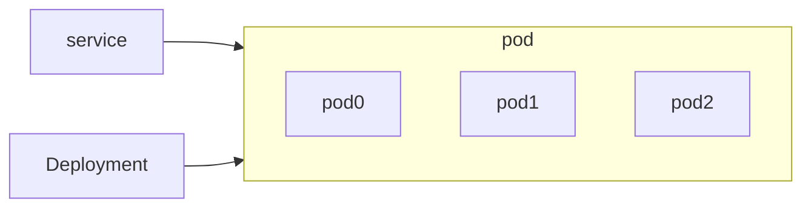

### 配置说明

k8s文档：https://kubernetes.io/zh-cn/docs/home/

K8s 简单理解就是一个配置驱动的，或者元数据驱动，或者声明式的框架

编写Deployment

+ apiVersion
+ spec，可以理解为说明书
  + replicas
  + selector : 筛选器，在所有的pod中，要管理哪三个pod。可以用matchLabels (根据给出的label值筛选) 和matchExpressions (根据表达式筛选)。
  + template : 该怎么创建每个pod。Kind不同时template也不同。

编写Service

只有 Deployment 无法从外面访问，需要将 Pod 封装为一个逻辑上的服务，即 Service。

+ apiVersion
+ kind
+ metadata
+ spec
  + type：可选择负载均衡
  + ports：端口

goland有k8s的插件，编写配置文件很方便


### 安装

直接在docker desktop中使用k8s，另外需要安装一个kubectl （设备：macbook）

docker desktop中如果启动k8s一直是starting状态，可能是网络问题无法拉取镜像

记得切换Kubernetes运行上下文至 docker-for-desktop

```shell
# 切换
kubectl config use-context docker-desktop

# 查看
kubectl get node
NAME             STATUS   ROLES           AGE   VERSION
docker-desktop   Ready    control-plane   70m   v1.27.2

# 查看
kubectl describe node docker-desktop
```


### 用 Kubernetes 部署 web 服务器

入门例子：部署三个web服务器实例，需要一个service，一个deployment，三个pod，每个pod是一个实例

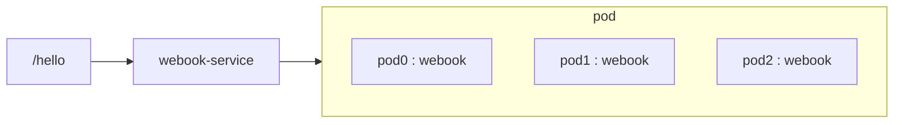


### 用 Kubernetes 部署 Redis

仅部署单机版redis，不考虑持久化问题。

port、nodePort 和 targetPort 的含义

+ port : 是指 Service 本身的，比如在 Redis 里面连接信息用的就是 demo-redis-service:6379
+ nodePort : 是指在 K8s 集群之外访问的端口，比如说执行 redis-cli -p 30379
+ targetPort : 是指 Pod 上暴露的端口


### 用 Kubernetes 部署 MySQL

部署MySQL与前面部署web服务器和redis不同的一点是，其需要数据持久化。

在 K8s 里面，存储空间被抽象为 PersistentVolume(持久化卷)。

如何理解 PersistentVolume？

+ 作为 K8s 的设计者，不知道容器里面运行的会是什么东西，需要怎么存储，管不了。
+ 从现实中来看，有各种设备用于存储数据，比如说机械硬盘、SSD，又比如说各种封装、各种文件协议，也管不了。 

最终你只能考虑提供一个抽象，让具体的实现去管了。


在已有service yaml和deployment yaml基础之上，分三步走：

+ Deployment yaml文件中加template

  在 template 里面，关键是 `spec.containers.volumeMounts` 和 `volumes`。

  +  `spec.containers.volumeMounts` 含义是挂载到容器的哪个地方
  +  `volumes` ：含义是这里挂载的东西究竟是什么

  ```yaml
  spec:
    replicas: 1
    selector:
      matchLabels:
        app: webook-mysql
    template:
      metadata:
        name: webook-mysql
        labels:
          app: webook-mysql
      spec:
        containers:
          - name: webook-mysql
            image: mysql:8.0
            imagePullPolicy: IfNotPresent
            env:
              - name: MYSQL_ROOT_PASSWORD
                value: root
            volumeMounts:
                # 与 mysql 的数据存储位置对应
              - mountPath: /var/lib/mysql
                # 确定具体用pod中的哪个 volume
                name: mysql-storage
            ports:
              - containerPort: 3306
        restartPolicy: Always
        #  POD 中有哪些volume
        volumes:
          - name: mysql-storage
            persistentVolumeClaim:
              claimName: webook-mysql-claim
  ```

  上面的配置中，含义是在 MySQL 里面挂载一 个目录 `/var/lib/mysql`。当容器读写这个目录的时候，实际上读写的是 `mysql-storage`。

  而 `mysql-storage` 究竟是什么，被一个叫做 `webook-mysql-claim` 的东西声明了。

+ 加PersistentVolumeClaim yaml文件

  一个容器需要什么存储资源，是通过 PersistentVolumeClaim 来声明的。

  比如说，我现在是 MySQL，我就需要告诉 K8s 我需要一些什么资源。K8s 就会为我找到对应的资源。

+ 加PersistentVolume yaml文件

  持久化卷，表达我是一个什么样的存储结构。

  所以，PersistentVolume 是存储本身说我有什么特性，而 PersistentVolumeClaim 是用的人告诉 K8s 说他需要什么特性。

  + storageClass : PersistentVolumeClaim 和 PersistentVolume 的yaml文件中的 storageClassName 要能对上

  + accessMode：访问模式。设想，如果你设计一个存储的东西，你是不是要考虑，我这个东西是只读还是只写？是允许 一个人访问，还是允许很多人访问？这就是由 accessMode 来控制的。

    在 PersistentVolume 里面，accessMode 是说明这个 PV 支持什么访问模式。

    在 PersistentVolumeClaim 里面，accessMode 是说明这个 PVC 需要怎么访问。

    accessMode有以下选项：

    + ReadWriteOnce : 只能被挂在到一个 Pod，被它读写。
    + ReadOnlyMany : 可以被多个 Pod 挂载，但是只能读。
    + ReadWriteMany : 可以被多个 Pod 挂载，它们都能读写。


### 用 Kubernetes 部署 Nginx

**什么是Ingress？**

用一句话来说，Ingress 代表路由规则。前端发过来的各种请求，在经过 Ingress 之后会转发到特定 的 Service 上。和 Service 中的 LoadBalancer 比起来，Service 强调的是将流量转发到 Pod 上，而 Ingress 强调的是发送到不同的 Service 上。


**Ingress 和 Ingress controller**

一个 Ingress controller 可以控制住整个集群内部的所有 Ingress(符合条件的 Ingress)。

或者这么说:

+ Ingress 是你的配置，配置了一些路由规则
+ Ingress controller 是执行这些配置的，实际执行转发的

站在 K8s 设计者的角度，K8s 只需要一份路由规则说明(Ingress)，至于谁来执行这个路由规则，怎么执行这个路由规则，不关心。


**安装 helm 和 ingress-nignx**

安装 helm

https://helm.sh/docs/intro/install/

```shell
curl -fsSL -o get_helm.sh https://raw.githubusercontent.com/helm/helm/main/scripts/get-helm-3
chmod 700 get_helm.sh
./get_helm.sh
```

也可以直接下载安装包

使用 helm 安装 ingress-nginx，运行

```shell
helm upgrade --install ingress-nginx ingress-nginx --repo https://kubernetes.github.io/ingress-nginx --namespace ingress-nginx --create-namespace
```

安装完 ingress-nginx 相当于把nginx安装好了， ingress-nginx相当于ingress controller。


编写 Ingress 配置文件

关键点

+ apiVersion 是一个新的东西，networking.k8s.io/v1，文档里面会告诉你这个值应该是什么。 
+ spec.ingressClassName 需要指定为 nginx，如果用别的 Ingress，也要指定对应的名字。
+ rules : 配置的你的转发规则，基本上就和你平时配置nginx 差不多。


## 用 k8s 部署 webook

### 步骤

1. k8s部署redis

   ```shell
   kubectl apply -f k8s-redis-deployment.yaml
   kubectl apply -f k8s-redis-service.yaml
   # 测试 : redis-cli -p {nodePort}
   ```

2. k8s部署mysql

   ```shell
   kubectl apply -f k8s-mysql-deployment.yaml
   kubectl apply -f k8s-mysql-service.yaml
   kubectl apply -f k8s-mysql-pvc.yaml
   kubectl apply -f k8s-mysql-pv.yaml
   ```

3. k8s部署nginx

   ```shell
   # 修改 /etc/hosts, 添加 : 127.0.0.1       practice.webook.com
   kubectl apply -f k8s-nginx-ingress.yaml
   ```

4. k8s部署webook

   + 修改代码根据go build 标签配置mysql和redis
   + 修改config/k8s.go中配置

   ```shell
   make docker
   kubectl apply -f k8s-webook-deployment.yaml
   kubectl apply -f k8s-webook-service.yaml
   ```

5. 测试

   测试结果见[test文件夹](https://github.com/rui-cs/webook/tree/main/test/k8s%E9%83%A8%E7%BD%B2webook)

附录：

1. 卸载

```shell
kubectl delete deployment webook-redis
kubectl delete service webook-redis

kubectl delete deployment webook-mysql
kubectl delete service webook-mysql

kubectl delete ingress webook-ingress

kubectl delete deployment webook
kubectl delete service webook
```

2. 常用命令

```shell
# 查看pod日志 pod 名称可以通过 kubectl get pods 获取
kubectl logs -f {pod 名称}  

# 删除 
kubectl delete service webook-redis 
kubectl delete deployment webook-redis
kubectl delete ingress webook-ingress

# 查看
kubectl get pvc
kubectl get pv
kubectl get ingress
kubectl get deployments
kubectl get services
kubectl get pods
kubectl get namespaces
kubectl get svc 
```

### 部署图


## **参考**

+ 主要内容来自大明训练营
+ 图解HTTP 6.7 小节
+ 透视HTTP协议 19课