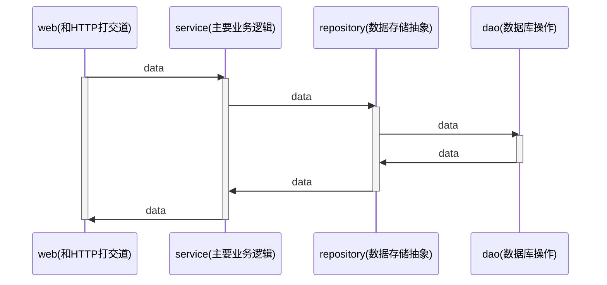

# webook

## **项目目录层级结构**

+ web : web 中的handler负责和HTTP有关的内容
+ service : 代表领域服务(domain service)。组合各种repository和domain，偶尔组合别的service，共同完成一个业务功能。
+ repository : 代表领域对象的存储。只代表数据存储，不代表数据库
  + dao : 代表数据库操作
+ domain : 代表领域对象

domain.User 是业务概念

dao.User 直接映射数据库中的表

## **密码加密**

+ service 加密：加密是一个业务概念
+ repository 加密：加密是一个存储概念
+ dao 加密：加密是一个数据库概念
+ domain 加密 ：加密是一个业务概念，但应该是“用户（User）”自己才知道怎么加密

选择servcie加密。

常见的加密算法

+ md5之类的哈希算法
+ 在第一点基础之上引入盐(salt)，或者多次哈希等
+ PBKDF2、BCrypt这一类随机盐值的加密算法，同样的文本加密后的结果都不一样

选择BCrypt加密，号称最安全的加密算法。优点有：

+ 不需要自己生成盐值
+ 不需要额外存储盐值
+ 可以通过控制cost来控制加密性能
+ 同样的文本，加密后的结果不同

bcrypt加密之后无法破解，只能同时比较加密之后的值来确定两者是否相等。

## **实现登录功能**

登录本身分为两部分

+ 实现登录功能 (/users/login接口)
+ 登录态校验 (Cookie, Session)

浏览器会把 Cookie (是一些数据，格式是键值对) 存储到本地，这样不太安全。

Cookie 使用字段

+ 响应头字段 Set-Cookie 
+ 请求头字段 Cookie

Cookie的关键配置

+ Max-Age和Expires : 过期时间。Max-Age 单位是秒，浏览器优先采用Max-Age计算失效期。
+ Domain和Path : Cookie 可以用在什么域名和路径下。设定原则：最小化原则
  + “Domain”和“Path”指定了 Cookie 所属的域名和路径，浏览器在发送 Cookie 前会从 URI 中提取出 host 和 path 部分，对比Cookie 的属性。如果不满足条件，就不会在请求头里发送 Cookie。
+ HttpOnly : 设置为true时，浏览器上的JS代码将无法使用这个Cookie。防止“跨站脚本”（XSS）攻击窃取数据，提升Cookie安全性。
+ SameSite : 是否允许跨站发送Cookie。防范“跨站请求伪造”（XSRF）攻击，提升Cookie安全性。
+ Secure : 只能用于HTTPS协议。提升Cookie安全性。

Cookie应用：

+ Cookie 最基本的一个用途就是身份识别，保存用户的登录信息，实现会话事务。
+ Cookie 的另一个常见用途是广告跟踪。

Cookie总大小不能超过4K。

Cookie名称来源Magic Cookie，含义不透明的数据。

注意，Cookie 并不属于 HTTP 标准。

因为Cookie不安全，所以关键数据可以存储到Session中，并保存在后端。访问系统的时候带上session id，后端根据session id识别访问者身份。session id可放在：

+ Cookie
+ Header
+ 查询参数，即 ?sid=XXX

session中的数据存储在 `store` 结构中。（https://github.com/gin-contrib/sessions）

store选择：

+ 单机单实例部署，可选择memstore，基于内存方式实现。
+ 多实例部署，可选择redis。

redis实现store中需要

+ authentication：身份认证
+ encryption：数据加密

信息安全的三个核心概念：authentication，encryption，authorization（授权，即权限控制）

gin-session中间件的各种类型实现是面向接口编程的。可以自由切换。当你在设计核心系统的时候，或者你打算提供什么功能给用户的时候，一定要问问自己，将来有没有可能需要不同的实现。

session 刷新

需要在用户持续使用网站时，刷新过期时间。

刷新策略

+ 每次访问都刷新：性能差，对redis影响大
+ 快过期的时候刷新：快过期的时候用户没访问无法刷新
+ 固定间隔时间刷新：比如每分钟内第一次访问都刷新
+ 使用长短token

设置session有效期为60s，在登录校验的middleware中，登录校验之后顺手刷新。刷新规则是，如果没有设置过session的update_time 或者当前时间超过update_time 10s，则重置session有效期。

登录状态保持多久比较好？ 

登录状态保持多久比较好？也就是，一次登录之后，要隔多久才需要继续登录？ 

答案是取决于你的产品经理，也取决于你系统其它方面的安全措施。 

简单来说，就是如果你有别的验证用户身份的机制，那么你就可以让用户长时间不需要登录。

上述60s和10s都可根据实际情况修改。

## **/users/profile 和 /users/edit 接口设计**

/users/profile 接口设计

返回信息：邮箱，用户名，生日，个人简介

/users/edit 接口设计

可修改用户名、生日、个人简介

需校验生日格式，用户名唯一

返回错误：系统错误 / 用户名重复 / 生日格式错误返回 http code 400 Bad Request

实现：旧版设计是要从email定位用户，后修改为从session中拿出userID定位用户。按照web-->service-->repository-->dao层次操作数据库即可。

测试结果：截图在test文件

## JWT

## **参考**

+ 主要内容来自大明训练营
+ 图解HTTP 6.7 小节
+ 透视HTTP协议 19课