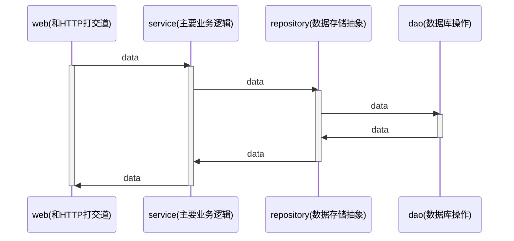

# webook

**项目目录层级结构**

+ web : web 中的handler负责和HTTP有关的内容
+ service : 代表领域服务(domain service)。组合各种repository和domain，偶尔组合别的service，共同完成一个业务功能。
+ repository : 代表领域对象的存储。只代表数据存储，不代表数据库
  + dao : 代表数据库操作
+ domain : 代表领域对象

domain.User 是业务概念

dao.User 直接映射数据库中的表

**密码加密**

+ service 加密：加密是一个业务概念
+ repository 加密：加密是一个存储概念
+ dao 加密：加密是一个数据库概念
+ domain 加密 ：加密是一个业务概念，但应该是“用户（User）”自己才知道怎么加密

选择servcie加密。

常见的加密算法

+ md5之类的哈希算法
+ 在第一点基础之上引入盐(salt)，或者多次哈希等
+ PBKDF2、BCrypt这一类随机盐值的加密算法，同样的文本加密后的结果都不一样

选择BCrypt加密，号称最安全的加密算法。优点有：

+ 不需要自己生成盐值
+ 不需要额外存储盐值
+ 可以通过控制cost来控制加密性能
+ 同样的文本，加密后的结果不同

bcrypt加密之后无法破解，只能同时比较加密之后的值来确定两者是否相等。

**实现登录功能**

登录本身分为两部分

+ 实现登录功能 (/users/login接口)
+ 登录态校验 (Cookie, Session)

