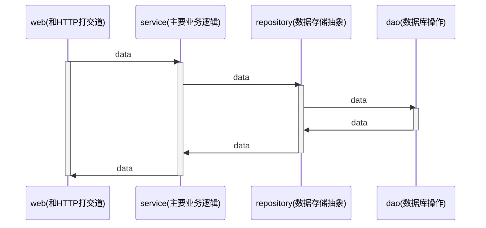

# webook

项目目录层级结构：

+ service : 代表领域服务(domain service)。组合各种repository和domain，偶尔组合别的service，共同完成一个业务功能。
+ repository : 代表领域对象的存储。只代表数据存储，不代表数据库
  + dao : 代表数据库操作
+ domain : 代表领域对象

domain.User 是业务概念

dao.User 直接映射数据库中的表