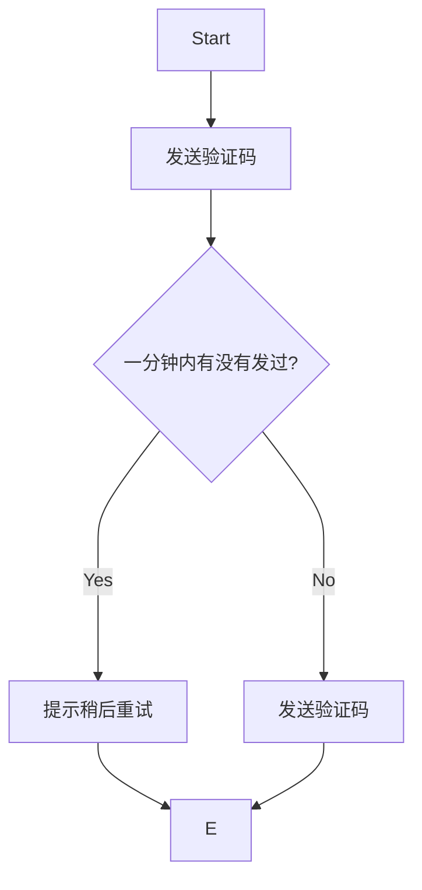
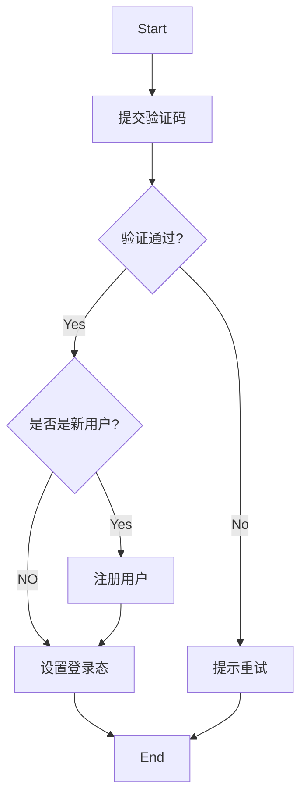

# webook

## **项目目录层级结构**

+ web : web 中的handler负责和HTTP有关的内容
+ service : 代表领域服务(domain service)。组合各种repository和domain，偶尔组合别的service，共同完成一个业务功能。
+ repository : 代表领域对象的存储。只代表数据存储，不代表数据库
  + dao : 代表数据库操作
+ domain : 代表领域对象


domain.User 是业务概念

dao.User 直接映射数据库中的表


**gin**

web 框架采用 https://gin-gonic.com/zh-cn/

gin middleware 库： https://github.com/gin-gonic/contrib 使用`Engine.Use`。


**middleware**

middleware 是 Go 这里用得比较多的说法，在别的语言里面可能叫做 plugin、handler、filter、 interceptor。


请求都要经过这些 middleware，所以适合用来解决一些所有业务都关心的东西。比如说里的跨域问题，注册的所有的路由都需要解决。也叫做 AOP(Aspect-Oriented Programming) 解决方案。


## **密码加密**

可以选择在不同的层加密

+ service 加密：加密是一个业务概念
+ repository 加密：加密是一个存储概念
+ dao 加密：加密是一个数据库概念
+ domain 加密 ：加密是一个业务概念，但应该是“用户（User）”自己才知道怎么加密

选择servcie加密。

常见的加密算法

+ md5之类的哈希算法
+ 在第一点基础之上引入盐(salt)，或者多次哈希等
+ PBKDF2、BCrypt这一类随机盐值的加密算法，同样的文本加密后的结果都不一样

选择BCrypt加密，号称最安全的加密算法。优点有：

+ 不需要自己生成盐值
+ 不需要额外存储盐值
+ 可以通过控制cost来控制加密性能
+ 同样的文本，加密后的结果不同

bcrypt加密之后无法破解，只能同时比较加密之后的值来确定两者是否相等。


## 登录功能实现(账号密码)及登录态实现(session)

登录本身分为两部分

+ 实现登录功能 (/users/login接口)
+ 登录态校验 (Cookie, Session)


浏览器会把 Cookie (是一些数据，格式是键值对) 存储到本地，这样不太安全。

Cookie 使用字段

+ 响应头字段 Set-Cookie 
+ 请求头字段 Cookie

Cookie的关键配置

+ Max-Age和Expires : 过期时间。Max-Age 单位是秒，浏览器优先采用Max-Age计算失效期。
+ Domain和Path : Cookie 可以用在什么域名和路径下。设定原则：最小化原则
  + “Domain”和“Path”指定了 Cookie 所属的域名和路径，浏览器在发送 Cookie 前会从 URI 中提取出 host 和 path 部分，对比Cookie 的属性。如果不满足条件，就不会在请求头里发送 Cookie。
+ HttpOnly : 设置为true时，浏览器上的JS代码将无法使用这个Cookie。防止“跨站脚本”（XSS）攻击窃取数据，提升Cookie安全性。
+ SameSite : 是否允许跨站发送Cookie。防范“跨站请求伪造”（XSRF）攻击，提升Cookie安全性。
+ Secure : 只能用于HTTPS协议。提升Cookie安全性。

Cookie应用：

+ Cookie 最基本的一个用途就是身份识别，保存用户的登录信息，实现会话事务。
+ Cookie 的另一个常见用途是广告跟踪。

Cookie总大小不能超过4K。

Cookie名称来源Magic Cookie，含义不透明的数据。

注意，Cookie 并不属于 HTTP 标准。


因为Cookie不安全，所以关键数据可以存储到Session中，并保存在后端。访问系统的时候带上session id，后端根据session id识别访问者身份。session id可放在：

+ Cookie
+ Header
+ 查询参数，即 ?sid=XXX

session中的数据存储在 `store` 结构中。（https://github.com/gin-contrib/sessions）


store选择：

+ 单机单实例部署，可选择memstore，基于内存方式实现。
+ 多实例部署，可选择redis。


redis实现store中需要

+ authentication：身份认证
+ encryption：数据加密

信息安全的三个核心概念：authentication，encryption，authorization（授权，即权限控制）


gin-session中间件的各种类型实现是面向接口编程的。可以自由切换。当你在设计核心系统的时候，或者你打算提供什么功能给用户的时候，一定要问问自己，将来有没有可能需要不同的实现。


session 刷新

需要在用户持续使用网站时，刷新过期时间。

刷新策略

+ 每次访问都刷新：性能差，对redis影响大
+ 快过期的时候刷新：快过期的时候用户没访问无法刷新
+ 固定间隔时间刷新：比如每分钟内第一次访问都刷新
+ 使用长短token

设置session有效期为60s，在登录校验的middleware中，登录校验之后顺手刷新。刷新规则是，如果没有设置过session的update_time 或者当前时间超过update_time 10s，则重置session有效期。


登录状态保持多久比较好？ 

登录状态保持多久比较好？也就是，一次登录之后，要隔多久才需要继续登录？ 

答案是取决于你的产品经理，也取决于你系统其它方面的安全措施。 

简单来说，就是如果你有别的验证用户身份的机制，那么你就可以让用户长时间不需要登录。

上述60s和10s都可根据实际情况修改。


## **/users/profile 和 /users/edit 接口设计**

/users/profile 接口设计

返回信息：邮箱，用户名，生日，个人简介

/users/edit 接口设计

可修改用户名、生日、个人简介

需校验生日格式，用户名唯一

返回错误：系统错误 / 用户名重复 / 生日格式错误返回 http code 400 Bad Request

实现：旧版设计是要从email定位用户，后修改为从session中拿出userID定位用户。按照web-->service-->repository-->dao层次操作数据库即可。

测试结果：截图在test文件


## 登录态实现(JWT)

除了使用 gin-session middleware 保持和校验登录态，也可以用JWT(JSON Web Token)。

JWT主要用于身份认证，即登录。

基本原理：通过加密生成一个 token，而后客户端每次访问的时候都带上这个 token。


JWT 简介 

它由三部分组成： 

+ Header：头部，JWT 的元数据，也就是描述这个token 本身的数据，一个 JSON 对象。 
+ Payload：负载，数据内容，一个 JSON 对象。 
+ Signature：签名，根据 header 和 token 生成。


如何进行接入改造？

使用 JWT 原始 API ：go get github.com/golang-jwt/jwt/v5 

在登录过程中，使用 JWT 也是两步： 

+ JWT 加密和解密数据
+ 登录校验

过程：

+ 在 Login 接口中，登录成功后生成 JWT token。 
  + 在 JWT token 中写入数据。 
  + 把 JWT token 通过 HTTP Response Header `x-jwt-token` 返回。 

+ 改造跨域中间件，允许前端访问 `x-jwt-token` 这个响应头。 

+ 接入 JWT 登录校验的 Gin middleware。 
  + 读取 JWT token。 
  + 验证 JWT token 是否合法。 

+ 下发HTTP请求时要携带 JWT token。
+ 从session中获取userID的地方需要改为从JWT中获取userID，如 /users/profile，/users/edit 接口


JWT 的优缺点 

和 Session 比起来，优点： 

+ 不依赖于第三方存储。 
+ 适合在分布式环境下使用。 
+ 提高性能（因为没有 Redis 访问之类的）。 

缺点： 

+ 对加密依赖非常大，比 Session 容易泄密。 
+ 最好不要在 JWT 里面放置敏感信息。


混用 JWT 和 Session 机制 

前面 JWT 限制了我们不能使用敏感数据，那么你真有类似需求的时候，就可以考虑将数据放在 “Session”里面。 

基本的思路就是：你在 JWT 里面存储你的 userID，然后用 userID 来组成 key，比如说 user.info:123 这种 key，然后用这个 key 去 Redis 里面取数据，也可以考虑使用本地缓存数据。


## 保护系统(限流)

保护系统要考虑两方面

+ 正常用户会不会搞崩你的系统？
+ 如果有人攻击你的系统，能否撑得住？

现在系统最明显的漏洞

+ 任何人都能注册
+ 任何人都能登录

限流是常见的保护系统的手段。限制每个用户每秒最多发送固定请求的数量。

问题

+ 怎么判定请求是某个用户的？未登录成功时，不知道用户是谁
+ 怎么确定限流阈值？

第一个问题：限流对象，可以用IP / MAC地址 / 设备标识符(CPU序列号) 。

第二个问题：阈值问题，理论上来说，这应该是通过压测来得到的。比如说你压测整个系统，发现最多只能撑住每秒 1000 个请求，那么阈值就是 1000。而我们是针对个人，搞不了压测。所以可以凭借经验来设置，比如说我们正常人手速，一秒钟撑死一个请求，那么就算我们考虑到共享 IP 之类的问题，给个每秒 100 也已经足够了。

实现：用redis做限流


## 增强登录安全

这种实现方式有个问题，不管是用 JWT 还是 Session，一旦被攻击者拿到关键的 JWT 或者 ssid，攻击者就能假冒你。 HTTPS 可以有效阻止攻击者拿到你的 JWT 或者 ssid。 但是如果你电脑中了病毒，那 HTTPS 就无能为力。

在用户登录校验过程中，得进一步判断，用这个 JWT/ssid 的人是不是原本登录的那 个人。目前做得好的都是使用二次验证，也就是发邮件、 发短信等。但是也有一些比较初步但也好用的手段，那就是用登录的辅助信息来判断。


登录的时候，记录当时登录的一些额外信息。比如说:

+ 使用的浏览器：对应到HTTP的User-Agent头部
+ 硬件信息：手机APP比较多见。

在登录校验的时候，比较一下你当次请求的这些辅助信 息和上一次的信息，不一样就认为有风险

问题:能不能用 IP? 不能，IP随时可能会切换


需要改造两个地方：

+ Login接口，在JWTtoken里面带上User-Agent信息。
+ JWT登录校验中间件，在里面比较User-Agent。


## 跨域问题处理

什么是跨域请求？

协议、域名和端口任意一个不同，都是跨域请求

从postman发送本地请求不会遇到跨域问题，但是从浏览器发送请求就可能会遇到。浏览器有这样一个机制，会自动发送preflight请求。


CORS middleware (https://github.com/gin-gonic/contrib/tree/master/cors)

+ AllowOriginFunc : 哪些来源是允许的。
+ AllowHeader : 业务请求中可以带上的头。 
+ AllowCrendentials : 是否允许带上用户认证信息(比如 cookie)。
+ ExposedHeaders : 允许显示的响应头（这样前端才能拿到）


/users/login 接口测试跨域问题解决效果

request header 中有

```
Host: localhost:8080
Origin: http://localhost:3000
Referer: http://localhost:3000/
```

response header 中有

```
Access-Control-Allow-Credentials: true
Access-Control-Allow-Origin: http://localhost:3000
Access-Control-Expose-Headers: X-Jwt-Token
Vary: Origin
```


跨域问题要点

+ 跨域问题是因为发请求的`协议+域名+端口`和接收请求的`协议+域名+端口`对不上。比如说从 localhost:3000 发到 localhost:8080 上。
+ 解决跨域问题的关键是在 preflight 请求里面告诉浏览器自己愿意接收请求。
+ Gin 提供了解决跨域问题的 middleware，可以直接使用。
+ middleware 是一种机制，可以用来解决一些所有业务都关心的问题，使用 Use 方法来注册middleware


## 压力测试与性能优化

### wrk 介绍

使用wrk压测接口。

能否用postman压力测试？

**wrk 安装**

+ 可以用apt install wrk或者Mac上brew instal lwrk

+ 源码安装 : 直接源码下载git clone https://github.com/wg/wrk.git 

  而后进去这个 wrk 目录下，执行 make 命令编译。 

  编译之后你会得到一个 wrk 可执行文件，将它加入你的环境变量。


### 开始压测

压测三个接口

+ 注册 : 写为主的接口
+ 登录 : 读为主的接口
+ Profile : 读为主的接口


**压测前准备**

压测注册接口，关键的是要发起 post 请求，然后传入不同的邮箱来模拟注册过程。

用脚本测试，按照步骤运行就可以。 首先:

+ 启用JWT来测试——因为比较好测试。如果对代码理解比较深刻，也可以使用 Session。
+ 修改/users/login对应的登录态保持时间，修改为 30 分钟，目的是确保在测试 profile 接口的时候，你拿到的 JWT token 没有过期。
+ 去除ratelimit限制


这里添加一点，项目中需要配置的地方在不同的情况内容是不同的，如压力测试要设置有效期为30分钟，而生产环境可能只有1分钟。配置部分可以利用go build tag 改造代码。


**压测注册接口**

在项目根目录下执行

```shell
wrk -t1 -d1s -c2 -s ./scripts/wrk/signup.lua http://localhost:8080/users/signup
# 可换不同的加密算法，测试性能
```

参数是可以调整的：

+ -t : 线程数量
+ -d : 持续时间。1s 是一秒， 1m是一分钟
+ -c : 并发数
+ -s : 后面跟着的是测试的脚本。

最终能跑多少，和运行环境有关。

测试结果

```

```


**压测登录接口**

在项目根目录下执行

```shell
wrk -t1 -d1s -c2 -s ./scripts/wrk/login.lua http://localhost:8080/users/login
```

因为登录接口也需要比较密码，所以同样可以考虑换加密算法。

测试结果

```

```


**压测 Profile 接口**

在项目根目录下执行

```shell
# 修改脚本中 User-Agent 和 对应的 Authorization
wrk -t1 -d1s -c2 -s ./scripts/wrk/profile.lua http://localhost:8080/users/profile
```

测试结果

```

```


**扩展练习**

+ 切换不同的加密算法，测试注册和登录接口。
+ 在脚本的基础上，在数据库中插入100W条用户数据，然后再测试登录接口。
+ 在数据库中插入1000W用户数据，然后再测试登录接口。


### **性能瓶颈**

在前面的代码里面，基本上性能瓶颈是出在两个地方：

+ 加密算法，耗费CPU，会令CPU成为瓶颈
+ 数据库查询

考虑引入 Redis 来优化第二点性能。用户会先从 Redis 里面查询，而后在缓存未命中的情况下，就会直接从数据库中查询。


这里有一个设计要点：查询和回写缓存操作redis的时候都有可能会出错。

查询这里要权衡，要防止大量请求到打到数据库上。业务代码要考虑，数据库也可以做限流（gorm middleware）。

回写缓存这里要权衡，要不要返回错误？要不要异步写入？

要综合考虑用户体验和服务(中间件)压力。

这里是这样设计和实现的：


### 优化并压测

**引入缓存**

但是，servcie不能直接操作 Redis，而是要引入一个缓存抽象。

同时也不是引入一个通用的 Cache，而是为业务编写专门的 Cache。也就是 UserCache。UserCache是业务专属缓存抽象。

引入一个专门的 UserCache 是为了解决：

+ 屏蔽过期时间设置问题。也就是说，使用这个 UserCache 的人不再关心过期时间的问题。
+ 屏蔽key的结构。也就是调用者不用知道在缓存里面的这个 key 是怎么组成的。
+ 屏蔽序列化与反序列协议。当结构体写入到 Redis 的时候，要决定如何序列化和反序列化。

如何集成 UserCache？

缓存属于“如何存储数据”的范畴，所以要在 Repository 这一层集成进去，Service 对这个应该是没有感知的。同样保持依赖注入的风格，将 DAO 和 Cache 实例都注入进去。


**登录要不要利用 Redis 来优化性能?**

前面只是使用缓存优化了 /users/profile 的性能， 那么登录需不需要呢?

要不要再按照 email 映射到用户基本信息缓存一下?

答案是 : 可以，但是收益不大。

因为登录是一个非常低频的事情，正常的互联网网站都是好几天才会让你登录一次，缓存了也没用。

可以优化的点是注册后缓存信息，因为一般注册后马上就会登录。


**优化后的压力测试结果**


### 附录

**Redis 数据结构(非底层实现)**

Redis 数据结构主要有:

+ string : 存储的key对应的值，是一个字符串。
+ list : 存储的key对应的值，就是一个链表。
+ set : 存储的key对应的值，是一个集合。
+ sortedset : 存储的key对应的值，是一个有序集合。
+ hash : 存储的key对应的值，是一个hash结构，也叫做字典结构、map结构。

还有不常用的 : bitmaps、JSON、streams、bitfields、time series。 

支持一些什么操作，可以通过 https://redis.io/commands/?group=set 来查看。


## 登录功能实现(短信验证码)

目前流行的除了账号密码登录以外，还可以是：

+ 短信验证码登录
+ 第三方平台登录
  + 微信扫码登录
  + 钉钉扫码登录
  + .......

以下实现短信验证码登录。


### 需求分析与系统设计

正常来说，如果你工作在国内的互联网公司，那么你收到的需求描述都是非常粗略的。 

所以你要掌握快速需求分析的小技巧，主要有三点： 

+ 参考竞品。应该说大部分互联网的功能都是你抄我我抄你的，所以你基本上可以参考竞品。 
+ 从不同角度分析： 
  + 功能角度：功能角度也就是明确我们做到哪些功能，有没有轻重缓急之分，一个具体的功能要做到什么程度。 
  + 非功能角度：对于中小型公司来说，按照这个顺序去思考 `安全性 > 扩展性 > 性能`。
    + 第一个保证你的系统不会被人恶意搞崩
    + 第二个是有限度应对将来的需求变更
    + 第三个是优化用户体验

+ 从正常和异常流程两个角度思考：注意区分业务异常流程和技术异常流程。 

注意，如果你的产品经理很称职，你问产品经理就可以。只有在产品经理不称职的情况下，你才需要花费比较多的功夫来分析需求。


参考竞品 

以我们这个验证码登录功能为例，你可以看不同公司的验证码登录的实现。 而后你就需要总结他们的功能特性： 

+ 大部分公司，在你发送手机验证码之前，都要求你先验证一下，比如说利用拼图，这一步你可以猜测是防止有人恶意触发发送短信。 
+ 大部分公司，在你发送了一个验证码之后，都不能连续发送，要隔一段时间。 
+ 大部分公司，在手机号码第一次使用的时候，直接会帮你注册一个账号。 
+ 大部分公司，手机验证码都有有效期。 
+ 大部分公司，你访问不同服务，手机验证码都是独立的，例如你在 A 功能上触发了手机验证码，在 B 功能上可以立刻触发再次发送验证码。 
+ 验证码只能使用一次，也就是验证码校验通过之后，这个验证码将无法再次使用。


从功能和非功能的角度分析 

在功能上，整个需求可以简单描述为： 

+ 允许用户使用手机号码接受验证码登录。在登录的时候，如果手机号码是一个全新的手机号码，那么直接注册一个新的账号。 
+ 手机验证码的有效期是 10 分钟。 
+ 用户一分钟内只能发送一次验证码。 
+ 用户登录/注册成功之后跳转到首页。 

在非功能上：保护系统，防止攻击者恶意发送短信


发送验证码流程



登录流程




接下来你要站在一个系统设计的角度去分析，怎么实现这个功能。 

`手机验证码登录`讨论了两个事情，一个是验证码， 一个是登录。这两个是强耦合的吗？ 

也就是，别的业务有可能用手机验证码吗？ 

除了登录功能，修改密码、危险操作二次验证等业务都需要用到验证码。

所以，手机验证码应该是一个独立的功能。 

+ 如果是模块，那么它是一个独立的模块。 
+ 如果是微服务，那么它是一个独立的微服务。

进一步你会发现，手机验证码要通过短信来发送， 那么短信是不是也会被别的业务使用？ 

在把它做成一个独立的功能之后，你要进一步想： 短信这个东西，有没有可能换供应商？ 

比如说今天买了腾讯的短信，明天买了阿里的短信，后天又买了别家的短信。


综合考虑，你会发现你有两个变化点： 

+ 不同业务都要用短信功能和验证码功能 
+ 可能换供应商 

所以你就要想，我现在该怎么留出一点点扩展的空间，保证万一后面新的业务要用验证码，我这边不动，或者说少动。 

万一要是换了供应商，我这边也可以少动或者不动。


服务划分 

也可以理解为模块划分。 

所以你需要： 

+ 一个独立的短信发送服务。 
+ 在独立的短信发送服务的基础上，封装一个验证码功能。 

+ 在验证码功能的基础上，封装一个登录功能。 

这就是业务上的超前半步设计，也叫做叠床架屋。


### 短信服务

在我们之前的分析里面，起点应该是短信服务。 

因为其它服务都是在它的基础上封装的，所以要最先弄完这个。 

而进一步考虑到不同的供应商，所以这一次我们需要从接口设计开始。 

那好，我们怎么知道该如何设计接口？

以特定供应商的短信 API 开始。

在大部分业务的初期，你是知道有什么地方有扩展， 但不知道将来会怎么扩展。所以你只需要考虑当下的需求，**然后做一个简单的抽象，预留出接口就可以**。 

**你不能指望，你能够设计一个接口，用上几十年，适配所有的需求变化，这是不现实的。** 

所以这里我们就选定腾讯的短信服务，来试着抽象一个接口。


分析腾讯短信 API 并进行接口抽象

你注意看腾讯短信 API 的特点。 

首先是初始化短信客户端，里面要求传入各种鉴权参数。 

其次是发送一条短信的请求构造，里面传入的主要是短信本身相关的参数。关键的是： 

+ 目标手机号码 
+ appId：你在腾讯短信上创建的应用的 ID。 
+ 签名：要求发送的短信必须标记是谁发的。 
+ 模板：要求你提前在服务商里面配置好，得到模板 ID。 
+ 参数：发送短信的时候的具体参数。

于是你可以总结出来一个东西，对于初始化客户端来说， 主要是鉴权。但这本身算是某种特定实现在初始化的时候需要解决的内容。 

发送一次消息，需要的参数：目标手机号码、appId、 签名、模板、参数。 

其中 appId 和签名在我们小微书里面都是固定的，同样可以在初始化的时候指定，但是发送的时候就不用传递参数了。


添加 sms 包后目录结构

这个 sms 被我放在了 service 包里面，是因为我认为它是一个服务。 

业界有一些人的做法是专门准备一个第三方包，然后放进去。 

我不采用第三方包，是因为第三方不属于一种业务概念， 它是一种横向切割方式，而我做成服务，依旧是保留了竖向切割。 

这两种做法我个人认为都没什么问题，你看自己喜好。


实现

1. 定义与初始化 

   在这里，我依旧保持了依赖注入的形式，即要求外界传入一个 client，而不是自己在内部初始化一个 client。 

   （PS：理论上你可以在 NewService 里面自己初始化这个客户端。）

2. 发送实现 

   实现很简单，就是根据腾讯文档里面的描述来解析消息。 

   注意，这里我在返回 error 的时候，尽量把必要的错误信息都封装好了。


运行测试 

短信发送需要很多信息，这些需要你去开通短信服务，或者用公司的短信配置才能运行。 

+ SMS_SECRET_ID: 在环境变量中，你需要配置成自己的参数。 

+ SMS_SECRET_KEY：在环境变量中，你需要配置成自己的参数。 

appId 和 signName 你一样需要替换成自己的。 

tplId 也要换成自己的。


## Kubernetes 入门

[示例](https://github.com/rui-cs/go-learning/tree/main/kubernetes)


初学记住几个基本概念

+ Pod ：实例
+ Service ： 逻辑上的服务
+ Deployment ： 管理Pod

Pod 和 Service 最简单的理解方式：假如说你有一个 Web 应用，部署了三个实例，那么就是一个 Web Service，对应了三个 Pod。

Deployment 最好的理解方式：你跟运维说要保证我的 Web 有三个实例，少了运维就重启一个，多了运维就删除一个，运维就是那个 Deployment。


### 配置说明

k8s文档：https://kubernetes.io/zh-cn/docs/home/

K8s 简单理解就是一个配置驱动的，或者元数据驱动，或者声明式的框架

编写Deployment

+ apiVersion
+ spec，可以理解为说明书
  + replicas
  + selector : 筛选器，在所有的pod中，要管理哪三个pod。可以用matchLabels (根据给出的label值筛选) 和matchExpressions (根据表达式筛选)。
  + template : 该怎么创建每个pod。Kind不同时template也不同。

编写Service

只有 Deployment 无法从外面访问，需要将 Pod 封装为一个逻辑上的服务，即 Service。

+ apiVersion
+ kind
+ metadata
+ spec
  + type：可选择负载均衡
  + ports：端口

goland有k8s的插件，编写配置文件很方便


### 安装

直接在docker desktop中使用k8s，另外需要安装一个kubectl （设备：macbook）

docker desktop中如果启动k8s一直是starting状态，可能是网络问题无法拉取镜像

记得切换Kubernetes运行上下文至 docker-for-desktop

```shell
# 切换
kubectl config use-context docker-desktop

# 查看
kubectl get node
NAME             STATUS   ROLES           AGE   VERSION
docker-desktop   Ready    control-plane   70m   v1.27.2

# 查看
kubectl describe node docker-desktop
```


### 用 Kubernetes 部署 web 服务器

入门例子：部署三个web服务器实例，需要一个service，一个deployment，三个pod，每个pod是一个实例


### 用 Kubernetes 部署 Redis

仅部署单机版redis，不考虑持久化问题。

port、nodePort 和 targetPort 的含义

+ port : 是指 Service 本身的，比如在 Redis 里面连接信息用的就是 demo-redis-service:6379
+ nodePort : 是指在 K8s 集群之外访问的端口，比如说执行 redis-cli -p 30379
+ targetPort : 是指 Pod 上暴露的端口


### 用 Kubernetes 部署 MySQL

部署MySQL与前面部署web服务器和redis不同的一点是，其需要数据持久化。

在 K8s 里面，存储空间被抽象为 PersistentVolume(持久化卷)。

如何理解 PersistentVolume？

+ 作为 K8s 的设计者，不知道容器里面运行的会是什么东西，需要怎么存储，管不了。
+ 从现实中来看，有各种设备用于存储数据，比如说机械硬盘、SSD，又比如说各种封装、各种文件协议，也管不了。 

最终你只能考虑提供一个抽象，让具体的实现去管了。


在已有service yaml和deployment yaml基础之上，分三步走：

+ Deployment yaml文件中加template

  在 template 里面，关键是 `spec.containers.volumeMounts` 和 `volumes`。

  +  `spec.containers.volumeMounts` 含义是挂载到容器的哪个地方
  +  `volumes` ：含义是这里挂载的东西究竟是什么

  ```yaml
  spec:
    replicas: 1
    selector:
      matchLabels:
        app: webook-mysql
    template:
      metadata:
        name: webook-mysql
        labels:
          app: webook-mysql
      spec:
        containers:
          - name: webook-mysql
            image: mysql:8.0
            imagePullPolicy: IfNotPresent
            env:
              - name: MYSQL_ROOT_PASSWORD
                value: root
            volumeMounts:
                # 与 mysql 的数据存储位置对应
              - mountPath: /var/lib/mysql
                # 确定具体用pod中的哪个 volume
                name: mysql-storage
            ports:
              - containerPort: 3306
        restartPolicy: Always
        #  POD 中有哪些volume
        volumes:
          - name: mysql-storage
            persistentVolumeClaim:
              claimName: webook-mysql-claim
  ```

  上面的配置中，含义是在 MySQL 里面挂载一 个目录 `/var/lib/mysql`。当容器读写这个目录的时候，实际上读写的是 `mysql-storage`。

  而 `mysql-storage` 究竟是什么，被一个叫做 `webook-mysql-claim` 的东西声明了。

+ 加PersistentVolumeClaim yaml文件

  一个容器需要什么存储资源，是通过 PersistentVolumeClaim 来声明的。

  比如说，我现在是 MySQL，我就需要告诉 K8s 我需要一些什么资源。K8s 就会为我找到对应的资源。

+ 加PersistentVolume yaml文件

  持久化卷，表达我是一个什么样的存储结构。

  所以，PersistentVolume 是存储本身说我有什么特性，而 PersistentVolumeClaim 是用的人告诉 K8s 说他需要什么特性。

  + storageClass : PersistentVolumeClaim 和 PersistentVolume 的yaml文件中的 storageClassName 要能对上

  + accessMode：访问模式。设想，如果你设计一个存储的东西，你是不是要考虑，我这个东西是只读还是只写？是允许 一个人访问，还是允许很多人访问？这就是由 accessMode 来控制的。

    在 PersistentVolume 里面，accessMode 是说明这个 PV 支持什么访问模式。

    在 PersistentVolumeClaim 里面，accessMode 是说明这个 PVC 需要怎么访问。

    accessMode有以下选项：

    + ReadWriteOnce : 只能被挂在到一个 Pod，被它读写。
    + ReadOnlyMany : 可以被多个 Pod 挂载，但是只能读。
    + ReadWriteMany : 可以被多个 Pod 挂载，它们都能读写。


### 用 Kubernetes 部署 Nginx

**什么是Ingress？**

用一句话来说，Ingress 代表路由规则。前端发过来的各种请求，在经过 Ingress 之后会转发到特定 的 Service 上。和 Service 中的 LoadBalancer 比起来，Service 强调的是将流量转发到 Pod 上，而 Ingress 强调的是发送到不同的 Service 上。


**Ingress 和 Ingress controller**

一个 Ingress controller 可以控制住整个集群内部的所有 Ingress(符合条件的 Ingress)。

或者这么说:

+ Ingress 是你的配置，配置了一些路由规则
+ Ingress controller 是执行这些配置的，实际执行转发的

站在 K8s 设计者的角度，K8s 只需要一份路由规则说明(Ingress)，至于谁来执行这个路由规则，怎么执行这个路由规则，不关心。


**安装 helm 和 ingress-nignx**

安装 helm

https://helm.sh/docs/intro/install/

```shell
curl -fsSL -o get_helm.sh https://raw.githubusercontent.com/helm/helm/main/scripts/get-helm-3
chmod 700 get_helm.sh
./get_helm.sh
```

也可以直接下载安装包

使用 helm 安装 ingress-nginx，运行

```shell
helm upgrade --install ingress-nginx ingress-nginx --repo https://kubernetes.github.io/ingress-nginx --namespace ingress-nginx --create-namespace
```

安装完 ingress-nginx 相当于把nginx安装好了， ingress-nginx相当于ingress controller。


编写 Ingress 配置文件

关键点

+ apiVersion 是一个新的东西，networking.k8s.io/v1，文档里面会告诉你这个值应该是什么。 
+ spec.ingressClassName 需要指定为 nginx，如果用别的 Ingress，也要指定对应的名字。
+ rules : 配置的你的转发规则，基本上就和你平时配置nginx 差不多。


## 用 k8s 部署 webook

### 步骤

1. k8s部署redis

   ```shell
   kubectl apply -f k8s-redis-deployment.yaml
   kubectl apply -f k8s-redis-service.yaml
   # 测试 : redis-cli -p {nodePort}
   ```

2. k8s部署mysql

   ```shell
   kubectl apply -f k8s-mysql-deployment.yaml
   kubectl apply -f k8s-mysql-service.yaml
   kubectl apply -f k8s-mysql-pvc.yaml
   kubectl apply -f k8s-mysql-pv.yaml
   ```

3. k8s部署nginx

   ```shell
   # 修改 /etc/hosts, 添加 : 127.0.0.1       practice.webook.com
   kubectl apply -f k8s-nginx-ingress.yaml
   ```

4. k8s部署webook

   + 修改代码根据go build 标签配置mysql和redis
   + 修改config/k8s.go中配置

   ```shell
   make docker
   kubectl apply -f k8s-webook-deployment.yaml
   kubectl apply -f k8s-webook-service.yaml
   ```

5. 测试

   测试结果见[test文件夹](https://github.com/rui-cs/webook/tree/main/test/k8s%E9%83%A8%E7%BD%B2webook)

附录：

1. 卸载

```shell
kubectl delete deployment webook-redis
kubectl delete service webook-redis

kubectl delete deployment webook-mysql
kubectl delete service webook-mysql

kubectl delete ingress webook-ingress

kubectl delete deployment webook
kubectl delete service webook
```

2. 常用命令

```shell
# 查看pod日志 pod 名称可以通过 kubectl get pods 获取
kubectl logs -f {pod 名称}  

# 删除 
kubectl delete service webook-redis 
kubectl delete deployment webook-redis
kubectl delete ingress webook-ingress

# 查看
kubectl get pvc
kubectl get pv
kubectl get ingress
kubectl get deployments
kubectl get services
kubectl get pods
kubectl get namespaces
kubectl get svc 
```

### 部署图


## **参考**

+ 主要内容来自大明训练营
+ 图解HTTP 6.7 小节
+ 透视HTTP协议 19课