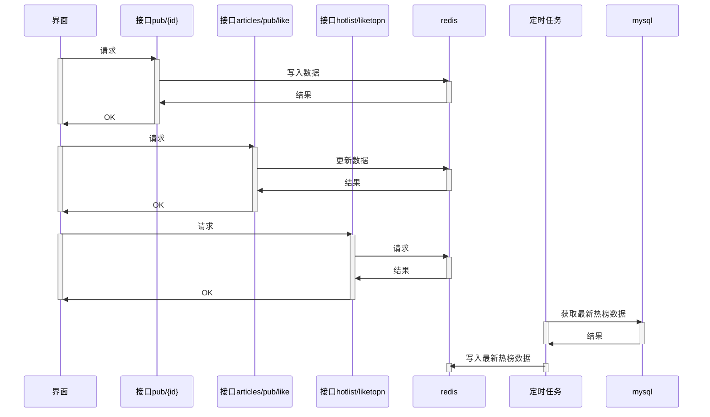
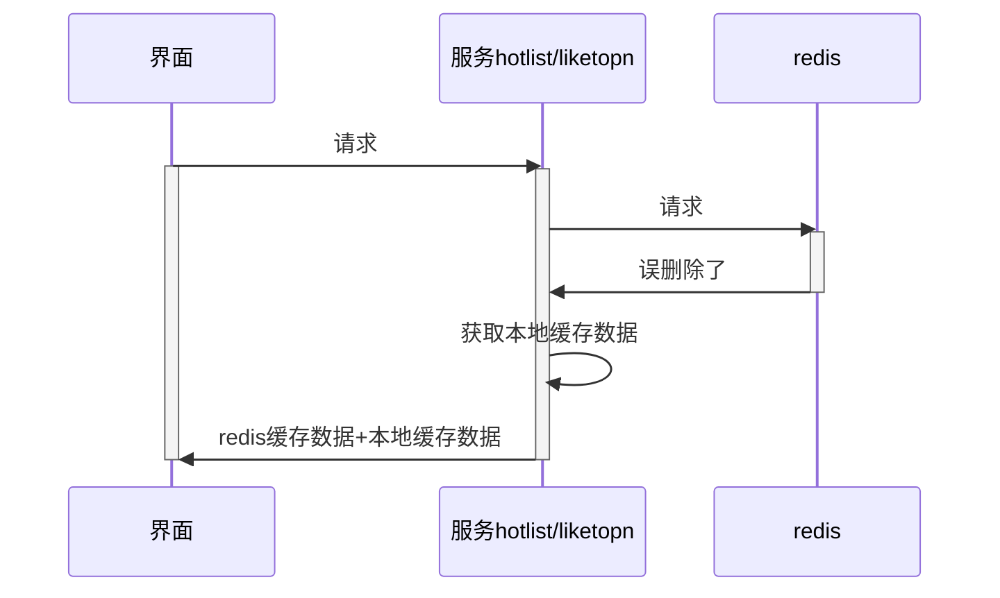

## 帖子功能

### 找出点赞数量前 N 的数据

#### 设计

##### 存储设计

热榜数据来源是表 `interactives` ，有领域id `biz_id`，领域名称 `biz`，点赞数量 `like_cnt`。

`pub/{id}` 接口会调用Get方法，此时如果缓存中没有对应数据会先查库再将 `interactives` 数据写入缓存。

```shell
127.0.0.1:6379> hgetall "interactive:article:17"
1) "like_cnt"
2) "3"
3) "collect_cnt"
4) "0"
5) "read_cnt"
6) "8"
```

热榜数据也缓存在redis中，数据结构使用zset，zset的key为领域名称。zset redis 测试见附录。

zset数据结构可以存储点赞数，也可以支持获取top N数据。

##### 接口设计

接口为`hotlist/liketopn`，返回每个领域biz的榜单top N，仅包含id及名称，不包含具体点赞数据。

接口为定时请求，按频率重复请求用以更新数据。

##### 实现设计

为获取top N数据，需要改造 `/articles/pub/like` 接口，在原有业务逻辑基础之上同时更新 redis 和本地缓存中的热榜数据。

+ 增加点赞时，如果点赞数超过10w则加入。

+ 取消点赞时，低于10w则删除。为简化实现，不处理，因每天定时重新生成数据，对key大小不会有太大影响

这部分实现使用装饰器模式。装饰原来的`InteractiveCacheRedis`。

redis和本地缓存中的热榜数据在服务启动的时候需要初始化，即从数据库中计算结果。





**缓存命中**

缓存命中情况即上图所示


**缓存未命中**

以下情况可能会出现缓存未命中

1. 写入缓存时失败。此种情况不处理，因为热榜数据一定会多次调用 `publish/{id}` 接口，所以不考虑偶发性的写入失败，如果经常性写入失败，和业务无关，和redis集群有关。

2. redis重启数据丢失：开启redis持久化功能(AOF/RDB)，备份数据，忽略丢失一点数据对业务影响

3. redis key被误删，这种情况需要考虑。添加本地缓存，服务启动时会初始化本地缓存，`hotlist/liketopn` 接口会更新本地缓存，如果redis中key被误删除了，则降级处理，拿本地缓存中的热榜数据

4. 如果redis查询报错也拿本地缓存中数据。

   此处有一点业务折中，当天新上榜的数据在本地缓存中不会体现，本地缓存中只会对初始化时存储的数据做操作（因为本地缓存中没有interactive服务的数据，没有交互数据就无法判断是否应该加入到hotlist中，而如果hostlist中包含全部数据则会有存储大小上限问题）




**业务折中**

`hotlist/liketopn` 接口只会在redis中查找数据，不会实时去数据库中查询。

除了以上提到的业务折中，还有以下考虑。

redis中缓存的热榜数据是在 `/articles/pub/like` 接口中更新的，可能存在更新失败的情况。添加定时任务，每天凌晨两点，业务不繁忙的时候，从数据库中把数据拿出来更新一次redis中的热榜数据。


##### 索引设计

表 ` Interactive` 中 `Id` 为主键，`<BizId,Biz>` 为联合唯一索引。

本方案设计中涉及sql有：

```sql
select distinct biz from interactives

SELECT biz, biz_id, like_cnt FROM `interactives` where biz = 'article' and like_cnt > 0 ORDER BY like_cnt DESC LIMIT 100
```

因为本方案只在启动服务和业务不繁忙时涉及到查库操作，建立其他索引使更新 ` Interactive` 表时因维护索引性能变差，所以不再建立其他索引。

#### 测试

##### 功能测试

1. 数据初始化：启动服务后redis中有热榜数据，`hotlist/liketopn`可正确返回数据

2. 点赞对热榜的影响：

   + 选择热榜中排名第一的文章，调用`like`接口点赞或者取消点赞，`hotlist/liketopn`查看到的点赞数据有对应变化

   + 当前热榜中倒数第二的数据是 `id`为 1692 的文章，点赞数量是 110800，未上榜的第一位数据是 `id ` 为 2118 的文章，点赞数据是 110791，调用 `like` 接口，为`id`  2118文章点赞10次，重新查询热榜，热榜倒数后两位数据变为 `id` 为2118的文章和 `id` 为1692的文章，点赞数分别为110801和110800

3. 使用本地缓存，停止redis服务，模拟redis宕机

   + 启动服务时，查询热榜数据，对比redis和本地缓存数据，一致
   + 调用 `like` 接口点赞或者取消点赞，`hotlist/liketopn` 接口查询到的本地缓存数据也有对应变化


##### 性能测试

使用 wrk 进行性能测试。

机器参数：cpu 个数10，内存16G

+ 1 threads and 1 connections

```shell
wrk -t1 -d10s -c1 --latency -s topn.lua http://127.0.0.1:8080/hotlist/liketopn
Running 10s test @ http://127.0.0.1:8080/hotlist/liketopn
  1 threads and 1 connections
  Thread Stats   Avg      Stdev     Max   +/- Stdev
    Latency    15.88ms   42.89ms 309.89ms   93.27%
    Req/Sec   271.41    317.52     1.30k    85.11%
  Latency Distribution
     50%    3.96ms
     75%    6.72ms
     90%   35.92ms
     99%  244.65ms
  2622 requests in 10.07s, 13.80MB read
Requests/sec:    260.50
Transfer/sec:      1.37MB
```

+ 1 threads and 2 connections

```shell
wrk -t1 -d10s -c2 --latency -s topn.lua http://127.0.0.1:8080/hotlist/liketopn
Running 10s test @ http://127.0.0.1:8080/hotlist/liketopn
  1 threads and 2 connections
  Thread Stats   Avg      Stdev     Max   +/- Stdev
    Latency    18.49ms   39.20ms 294.02ms   92.50%
    Req/Sec   258.82    395.10     1.93k    89.47%
  Latency Distribution
     50%    9.67ms
     75%   14.30ms
     90%   42.82ms
     99%  230.89ms
  2530 requests in 10.05s, 13.32MB read
Requests/sec:    251.62
Transfer/sec:      1.32MB
```

+ 2 threads and 2 connections

```shell
wrk -t2 -d10s -c2 --latency -s topn.lua http://127.0.0.1:8080/hotlist/liketopn
Running 10s test @ http://127.0.0.1:8080/hotlist/liketopn
  2 threads and 2 connections
  Thread Stats   Avg      Stdev     Max   +/- Stdev
    Latency    20.83ms   49.46ms 430.00ms   93.23%
    Req/Sec   130.57    224.36     1.12k    91.44%
  Latency Distribution
     50%    9.88ms
     75%   14.25ms
     90%   46.60ms
     99%  290.49ms
  2536 requests in 10.05s, 13.35MB read
Requests/sec:    252.24
Transfer/sec:      1.33MB
```

改变 thread 和 connection 数量对10s内处理总请求数影响不大。


#### 代码列表

共有三次提交

+ https://github.com/rui-cs/webook/commit/4913c6b0ab99582b1d93e325b39391c69d350349
+ https://github.com/rui-cs/webook/commit/a86ae913d64857ee50ad8527a1ce044a14104967
+ https://github.com/rui-cs/webook/commit/c165dee7ead914f9832e488a43b5b4ac4a7bf3e5

代码列表

+ wire ： https://github.com/rui-cs/webook/blob/feat/wire.go   https://github.com/rui-cs/webook/blob/feat/wire_gen.go
+ hotlist web ：https://github.com/rui-cs/webook/blob/feat/internal/web/hotlist.go
+ hotlist service ：https://github.com/rui-cs/webook/blob/feat/internal/service/hotlist.go
+ hotlist repository ： https://github.com/rui-cs/webook/blob/feat/internal/repository/hotlist.go
+ hotlist cache redis ：https://github.com/rui-cs/webook/blob/feat/internal/repository/cache/hotlist.go
+ hotlist cache local ： https://github.com/rui-cs/webook/blob/feat/internal/repository/cache/hotlist_local.go
+ hotlist dao ： https://github.com/rui-cs/webook/blob/feat/internal/repository/dao/hotlist.go
+ lua 脚本（获取热榜数据）：https://github.com/rui-cs/webook/blob/feat/internal/repository/cache/lua/hotlist_like_bizs.lua
+ lua 脚本（更新热榜数据）：https://github.com/rui-cs/webook/blob/feat/internal/repository/cache/lua/interative_incr_cnt_like.lua
+ 添加热榜后的interactive ： https://github.com/rui-cs/webook/blob/feat/internal/repository/cache/interactive_with_hotlist.go


#### 附录

zset测试

```shell
# 初始数据
127.0.0.1:6379> zadd article 22 id1 200 id2 12 id3 32 id5 43 id6 78 id7
(integer) 6
127.0.0.1:6379> rename article hotlist:biz:article:like
OK
# 获取排名
127.0.0.1:6379> zrange hotlist:biz:article:like 0 99 rev withscores
 1) "id2"
 2) "200"
 3) "id7"
 4) "78"
 5) "id6"
 6) "43"
 7) "id5"
 8) "32"
 9) "id1"
10) "22"
11) "id3"
12) "12"
# 增加点赞数
127.0.0.1:6379> zincrby hotlist:biz:article:like 3 id5
"35"
127.0.0.1:6379> zincrby hotlist:biz:article:like -2 id2
"198"
127.0.0.1:6379> zrange hotlist:biz:article:like 0 99 rev withscores
 1) "id2"
 2) "198"
 3) "id7"
 4) "78"
 5) "id6"
 6) "43"
 7) "id5"
 8) "35"
 9) "id1"
10) "22"
11) "id3"
12) "12"
# 计算个数
127.0.0.1:6379> zcount hotlist:biz:article:like -inf +inf
(integer) 6
# 删除某个key
127.0.0.1:6379> zrem hotlist:biz:article:like id1
(integer) 1
127.0.0.1:6379> zrange hotlist:biz:article:like 0 99 rev withscores
 1) "id2"
 2) "198"
 3) "id7"
 4) "78"
 5) "id6"
 6) "43"
 7) "id5"
 8) "35"
 9) "id3"
10) "12"


# 另一个领域
127.0.0.1:6379> zadd hotlist:biz:video:like 22 id1 200 id2 12 id3 32 id5 43 id6 78 id7
(integer) 6
```
